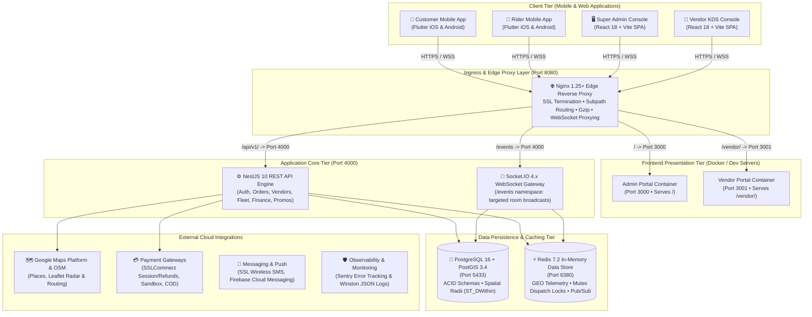
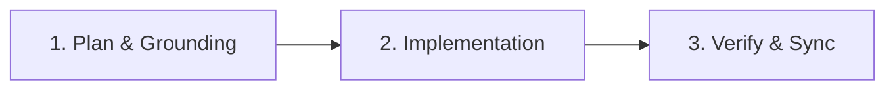

# DeliveryOS — On-Demand Hyperlocal Delivery Platform
### Enterprise Multi-Vendor Delivery Engine for Food, Grocery, Super Shop & Retail

Welcome to the **DeliveryOS** repository.  
DeliveryOS is a production-grade, multi-vertical on-demand delivery ecosystem engineered for hyper-growth logistics across emerging and global markets.

---

## 🌟 Platform Mission & Multi-Vertical Architecture

DeliveryOS provides a unified operational core that powers multiple retail and delivery business models on a single infrastructure:

- 🍔 **Food & Cloud Kitchens**: Real-time kitchen order display (KDS), preparation countdown timers, synthesized audio alerts, and automated rider dispatch.
- 🥦 **Grocery & Supermarkets**: Fast basket-building, category navigation, multi-weight items (`kg`, `500g`, `pack`), and high-density inventory stockout management.
- 💊 **Pharmacies & Healthcare**: OTC remedies, personal care, categorized prescription drops, and localized merchant support.
- 🏬 **Super Shops & Department Stores**: Multi-department product catalogs, mixed-item orders, and consolidated dispatch logistics.

### Monorepo Topology
```
DeliveryOS/
├── apps/
│   ├── admin_portal/       # Super Admin Control Tower (React 18 + Vite + TailwindCSS + Leaflet OSM)
│   ├── vendor_portal/      # Vendor Kitchen Display & Store Portal (React 18 + Vite + Web Audio API)
│   ├── customer_app/       # Consumer Ordering App (Flutter, Dart ^3.8, Riverpod 3)
│   └── rider_app/          # Courier Duty & Dispatch Cockpit (Flutter, Dart ^3.8, Riverpod 3)
│
├── services/
│   └── backend_api/        # Core API & Telemetry Engine (NestJS 10, PostgreSQL 16 + PostGIS, Redis 7.2)
│
├── deploy/
│   ├── docker-compose.yml       # Local multi-container topology (PostGIS, Redis, App Services, Nginx)
│   ├── docker-compose.prod.yml  # Production topology (TLS certbot renewal, non-root containers)
│   ├── init-postgis.sql         # Spatial extension bootstrap
│   ├── nginx.local.conf         # Local unified reverse proxy configuration
│   ├── nginx-templates/        # Production TLS reverse proxy template
│   └── systemd/                 # Automated database backup service & timer units
│
└── context_docs/           # Authoritative living specifications & AI governance suite
```

---

## 🏗️ System Architecture & Ingress Topology

Traffic enters through a unified Nginx edge proxy on port 8080 and is routed to dedicated presentation containers, micro-services, and real-time gateways:



---

## ⚡ 5-Minute Local Setup & Execution Guide

**Prerequisites**: Node.js 20+ • Docker & Docker Compose • Flutter (Dart SDK ^3.8).

> **One-command full stack** (optional): `./scripts/start-local.sh --docker` boots all six containers — PostGIS, Redis, backend, both portals, and the Nginx edge on `http://localhost:8080` (`/` admin • `/vendor/` KDS • `/api/v1/` API • `/events` WS).

Or run services individually:

**1. Create your env file** — single source for all services (never commit it):
```bash
cp .env.example .env
```

**2. Boot infrastructure** — PostgreSQL + PostGIS on `localhost:5433` (db `deliveryos`, user `postgres`, password `secretpassword`), Redis on `localhost:6380`:
```bash
docker compose -f deploy/docker-compose.yml up -d postgres redis
```

**3. Backend API** — REST at `http://localhost:4000/api/v1`, WebSocket at `ws://localhost:4000/events`:
```bash
cd services/backend_api
npm install && npx prisma migrate dev && npm run prisma:seed
npm run start:dev
```

**4. Web portals** — Super Admin on `:3000`, Vendor KDS on `:3001` (dev servers proxy `/api` and `/events` to `:4000`):
```bash
cd apps/admin_portal  && npm install && npm run dev   # terminal 1
cd apps/vendor_portal && npm install && npm run dev   # terminal 2
```

**5. Mobile apps**:
```bash
cd apps/customer_app && flutter pub get && flutter run -d chrome   # or an iOS/Android emulator
cd apps/rider_app    && flutter pub get && flutter run -d chrome
```

**Seeded dev logins** (mock OTP `123456`): Super Admin `+8801700000001` → [localhost:3000](http://localhost:3000) • Branch manager `+8801700000002` and brand owner `+8801700000003` → [localhost:3001](http://localhost:3001). The seed also creates the Burger Point + FreshMart Daily outlets with menus, coupons `WELCOME50` / `BURGER20`, banners, and `RIDER_FIRST` dispatch settings.

---

## 📸 Platform Application Showcase

| 🖥️ Super Admin Control Tower | 🍳 Vendor Kitchen Display System (KDS) |
| :---: | :---: |
|  |  |
| **Centralized Dispatch & Financial Control**<br/>• Real-time dispatch engine toggle<br/>• Interactive Leaflet OpenStreetMap live fleet radar<br/>• URL deep-linked order overrides (`?orderNumber=...`)<br/>• RFC 4180 CSV financial settlement exports | **3-Lane High-Contrast Kitchen Kanban**<br/>• 3-stage progression (*New*, *Preparing*, *Ready*)<br/>• Digital prep SLA countdown timers<br/>• Web Audio API dual-tone synthesized bell chime<br/>• 1-click Rush Hour emergency pause |

| 📱 Customer Ordering Experience | 🛵 Rider Fleet Duty Cockpit |
| :---: | :---: |
|  |  |
| **Hyperlocal Store Discovery & Cart**<br/>• Dynamic hero promotions & category filters<br/>• Direct Add-to-Cart with conflict replacement dialog<br/>• 6-stage order tracking stepper & live courier radar<br/>• One-tap Switch-to-COD on payment failure | **Active Duty & 3-Step Fulfillment**<br/>• One-tap shift toggle with in-flight delivery lock<br/>• Dual-sensory 45s dispatch broadcast alert<br/>• Atomic Redis mutex order claiming (`SET NX EX`)<br/>• 5-minute doorstep customer unresponsive SOP |

---

## 🧭 Spec-Driven Development Workflow (3-Phase Protocol)

Every change — feature, bug fix, or refactor — passes through **three sequential gates**. Never begin a phase before the previous gate passes, and never skip the living-docs sync.



| Phase | Objective | Key Actions | ✅ Exit Gate |
| :--- | :--- | :--- | :--- |
| **1. Plan & Grounding** | Understand the task before writing code | • Route via [`QUICK_REFERENCE.md`](context_docs/QUICK_REFERENCE.md) — load **only** the 1–2 relevant ADR/BRD/TID files.<br>• Verify architectural contracts in the [ADR Index](context_docs/architecture-decision-records/README.md), [BRDs](context_docs/business-requirements-documents/README.md), and [TIDs](context_docs/technical-implementation-documents/README.md).<br>• Resolve ambiguity with structured questions (recommended options; `/grill-me` for plan review). | A written plan aligned 100% with the specs — **zero open assumptions**. |
| **2. Implementation** | Production-ready code, built in dependency order | • Sequence: Prisma schema ➔ backend services & DTOs ➔ realtime events ➔ UI.<br>• Enforce `AGENT_RULES.md` § 3: strict typing (zero raw `any`), design tokens only (zero inline styles), ACID transactions for every money/state mutation, comments only for non-obvious invariants, zero mocks or `TODO`s. | Code complete and convention-clean per `AGENT_RULES.md` (§ 3). |
| **3. Verify & Sync** | Prove correctness and leave zero documentation drift | • Run the CI-identical quality gate: `npm run verify` (test-integrity guard, backend typecheck + lint + Jest unit tests + build, portal typechecks + Vitest unit tests + production builds, `flutter analyze` + `flutter test` ×2).<br>• Execute the test cases covering the change: targeted backend integration suites (`npm run auth:test`, `order:test`, `payment:test`, …) and portal smoke tests (`npm test`) against a live stack.<br>• Sync **every living document the change affects** — [`FEATURES.md`](FEATURES.md), [`CHANGELOG.md`](CHANGELOG.md), ADRs, plus any BRD/TID section, schema/endpoint spec, deploy note, or app README the change invalidates. | Quality gate green **and** living docs synced. |

**Git invariant (applies to every phase)**: **NO auto-commits** — `git commit` runs only on an explicit user command; **NO auto-push** — pushing requires its own explicit command.

### 📋 Repeatable Engineering Checklists

<details>
<summary><b>Checklist A: Adding a New Feature or Sub-Feature</b></summary>

- [ ] **1. Grounding**: Consult `QUICK_REFERENCE.md` to load only the required 1–2 spec files.
- [ ] **2. Invariant Check**: Verify compliance with related ADRs, state machines, and business rules.
- [ ] **3. Schema Migration**: Create and run Prisma migrations with proper indexes and PostGIS spatial types if schema evolves.
- [ ] **4. Backend DTO & Service**: Strictly typed DTOs with `class-validator`, ACID transaction in service, standard API envelope.
- [ ] **5. Realtime Events**: Wire Socket.IO room joins/emits and Redis pub/sub if real-time updates are involved.
- [ ] **6. UI Implementation**: Centralized design system tokens, responsive layouts, error handling, loading states.
- [ ] **7. Automated Verification**: Run `npm run verify` (or the affected subset: backend suites, `typecheck`, `flutter analyze` / `flutter test`).
- [ ] **8. Living Docs Sync**: Add line item to `FEATURES.md`, record deliverable in `CHANGELOG.md`.
- [ ] **9. Commit Protocol**: Await explicit user command before executing `git commit`.

</details>

<details>
<summary><b>Checklist B: Fixing an Existing Feature or Bug</b></summary>

- [ ] **1. Root Cause Analysis**: Reproduce the issue with an automated test before modifying code.
- [ ] **2. Spec Verification**: Confirm intended behavior in BRD and TID documents; verify no invariant is violated.
- [ ] **3. Surgical Fix**: Apply targeted code changes without broad, unnecessary rewrites.
- [ ] **4. Type & Style Adherence**: Zero raw `any`, zero inline colors/styles, zero trivial comments.
- [ ] **5. Regression Testing**: Run regression test suites (`npm run track1:test`, `flutter test`, etc.).
- [ ] **6. Living Docs Sync**: Record fix in `CHANGELOG.md` under `### Fixed`, update `FEATURES.md` if behavior changed.
- [ ] **7. Commit Protocol**: Await explicit user command before executing `git commit`.

</details>

<details>
<summary><b>Checklist C: Code Refactoring & Modernization</b></summary>

- [ ] **1. Architectural Alignment**: Ensure refactoring aligns with ADRs and preserves established patterns.
- [ ] **2. Interface Preservation**: Preserve public API signatures, DTO contracts, and component prop interfaces.
- [ ] **3. Token Extraction**: Replace hardcoded values with design system tokens (`AppColors`, `AppTypography`, `AppSpacing`).
- [ ] **4. Dead Code Cleanup**: Delete unused methods, obsolete imports, and commented-out code completely.
- [ ] **5. Static Analysis & Tests**: Verify `npm run typecheck` exits 0, `flutter analyze` reports 0 issues, and tests pass 100%.
- [ ] **6. Living Docs Sync**: Document refactoring in `CHANGELOG.md` under `### Changed`.
- [ ] **7. Commit Protocol**: Await explicit user command before executing `git commit`.

</details>

---

## ⚡ Core Operational Invariants

Every engineer and AI agent operating in this repository upholds the non-negotiable standards: **no auto-commits/pushes**, **zero raw `any`**, **zero inline styling** (design tokens only), **zero placeholder shortcuts**, **decompose & reuse**, **mandatory 3-phase workflow**, **test integrity** (never skip, weaken, or delete tests), **ADR synchronization**, **lean documentation**, **no trivial comments**, and **zero assumptions**.

➡️ The authoritative table with direct rule commands and `AGENT_RULES.md` section links lives in **[`AGENTS.md`](./AGENTS.md#-core-operational-invariants-matrix)** (single source of truth — kept in sync by the living-docs protocol).

---

## 📖 Master Documentation Index & Task Router

All authoritative system rules, business workflows, technical specifications, and architecture decisions are maintained in `context_docs/`:

1. **[Quick Reference & Context Router](./context_docs/QUICK_REFERENCE.md)** — Token-efficient task-to-document routing table (load 1–2 files only).
2. **[Spec-Driven Development Workflow](#-spec-driven-development-workflow-3-phase-protocol)** — Authoritative 3-phase engineering protocol (Plan ➔ Implement ➔ Verify & Sync) and repeatable checklists directly on this README.
3. **[Master AI Agent Rules & Invariants](./context_docs/AGENT_RULES.md)** — Engineering standards, DoD, and governance.
4. **[Master System Feature Catalog](./FEATURES.md)** — Line-level, granular catalog of every capability across all 5 sub-projects.
5. **[Changelog, Milestones & Engineering Roadmap](./CHANGELOG.md)** — Step-by-step engineering roadmap, active milestone tracker, and standardized Keep a Changelog (SemVer) release history.
6. **[Business Requirements Documents (BRD)](./context_docs/business-requirements-documents/README.md)**:
   - [`BRD-00: Master Product Overview`](./context_docs/business-requirements-documents/00-master-product-overview.md)
   - [`BRD-01: Executive Summary & Vision`](./context_docs/business-requirements-documents/01-executive-summary-and-vision.md)
   - [`BRD-02: Stakeholder Roles & Personas`](./context_docs/business-requirements-documents/02-stakeholder-roles-and-personas.md)
   - [`BRD-03: Core Business Rules & Workflows`](./context_docs/business-requirements-documents/03-core-business-rules-and-workflows.md)
   - [`BRD-04: Customer Experience & Journey`](./context_docs/business-requirements-documents/04-customer-experience-and-journey.md)
   - [`BRD-05: Merchant & Vendor Operations`](./context_docs/business-requirements-documents/05-merchant-and-vendor-operations.md)
   - [`BRD-06: Rider Fleet & Dispatch Handbook`](./context_docs/business-requirements-documents/06-rider-fleet-and-dispatch-handbook.md)
   - [`BRD-07: Admin Operations & Pilot Guide`](./context_docs/business-requirements-documents/07-admin-operations-and-pilot-guide.md)
7. **[Technical Implementation Documents (TID)](./context_docs/technical-implementation-documents/README.md)**:
   - [`TID-01: System Architecture & Tech Stack`](./context_docs/technical-implementation-documents/01-system-architecture-and-tech-stack.md)
   - [`TID-02: Database Schema & Data Models`](./context_docs/technical-implementation-documents/02-database-schema-and-data-models.md)
   - [`TID-03: API Specifications & Endpoints`](./context_docs/technical-implementation-documents/03-api-specifications-and-endpoints.md)
   - [`TID-04: Realtime Events & WebSocket Protocol`](./context_docs/technical-implementation-documents/04-realtime-events-and-websocket-protocol.md)
   - [`TID-05: Order State Machine & Dispatch Engine`](./context_docs/technical-implementation-documents/05-order-state-machine-and-dispatch-engine.md)
   - [`TID-06: Frontend & Mobile Architecture`](./context_docs/technical-implementation-documents/06-frontend-and-mobile-architecture.md)
   - [`TID-07: Deployment, DevOps & Environment Setup`](./context_docs/technical-implementation-documents/07-deployment-devops-and-environment-setup.md)
8. **[Architecture Decision Records (ADRs)](./context_docs/architecture-decision-records/README.md)**:
   - [`ADR-001`](./context_docs/architecture-decision-records/ADR-001-modular-monorepo-and-ingress-topology.md): Modular Monorepo Architecture & Nginx Edge Ingress Topology
   - [`ADR-002`](./context_docs/architecture-decision-records/ADR-002-dynamic-dual-order-flow-fsm.md): Dynamic Dual Order Flow State Machine
   - [`ADR-003`](./context_docs/architecture-decision-records/ADR-003-postgis-spatial-engine-and-redis-geohash.md): Spatial PostGIS Geofencing & Redis Geohash
   - [`ADR-004`](./context_docs/architecture-decision-records/ADR-004-atomic-dispatch-claim-mutex.md): Atomic Dispatch Claim Mutex
   - [`ADR-005`](./context_docs/architecture-decision-records/ADR-005-micro-frontends-and-subpath-routing.md): Micro-Frontends & Subpath Reverse Proxy
   - [`ADR-006`](./context_docs/architecture-decision-records/ADR-006-dual-store-frontend-paradigm-and-websocket-invalidation.md): Dual-Store Frontend Paradigm & WebSocket Invalidation
   - [`ADR-007`](./context_docs/architecture-decision-records/ADR-007-web-audio-api-synthesized-kds-chime.md): Web Audio API Synthesized KDS Chime
   - [`ADR-008`](./context_docs/architecture-decision-records/ADR-008-immutable-jsonb-historical-snapshots.md): Immutable JSONB Historical Snapshots
   - [`ADR-009`](./context_docs/architecture-decision-records/ADR-009-deterministic-financial-accounting-ledger.md): Deterministic Financial Accounting Ledger
   - [`ADR-010`](./context_docs/architecture-decision-records/ADR-010-ai-driven-engineering-governance-and-no-auto-commits.md): AI-Driven Engineering Governance & No-Auto-Commits
   - [`ADR-011`](./context_docs/architecture-decision-records/ADR-011-multi-gateway-online-payment-and-webhook-idempotency.md): Multi-Gateway Payment & Webhook Idempotency
   - [`ADR-012`](./context_docs/architecture-decision-records/ADR-012-production-security-hardening-and-fail-fast-config.md): Production Security Hardening, Fail-Fast Configuration & Authenticated Realtime Rooms
   - [`ADR-013`](./context_docs/architecture-decision-records/ADR-013-real-world-integration-stack.md): Real-World Integration Stack — SMS, SSLCommerz, FCM Push, Token Rotation & Background Telemetry
   - [`ADR-014`](./context_docs/architecture-decision-records/ADR-014-unit-tests-and-error-monitoring.md): Unit Test Toolchain (Jest) & Error Monitoring (Sentry)
   - [`ADR-015`](./context_docs/architecture-decision-records/ADR-015-horizontal-scaling-readiness.md): Horizontal-Scaling Readiness & Data Safety
