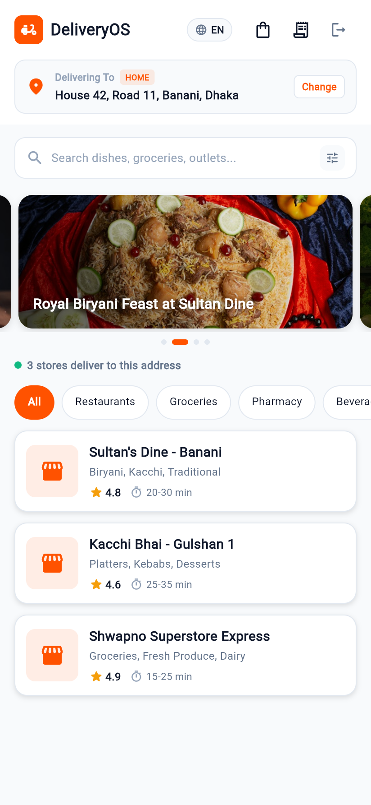
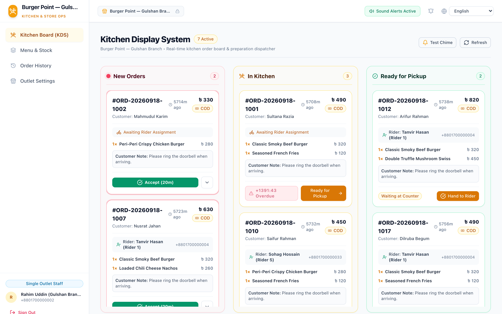
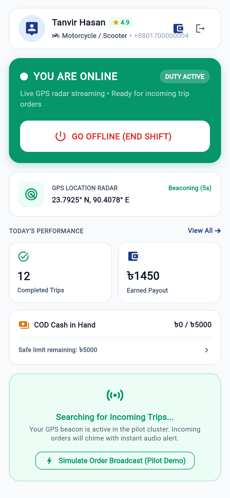
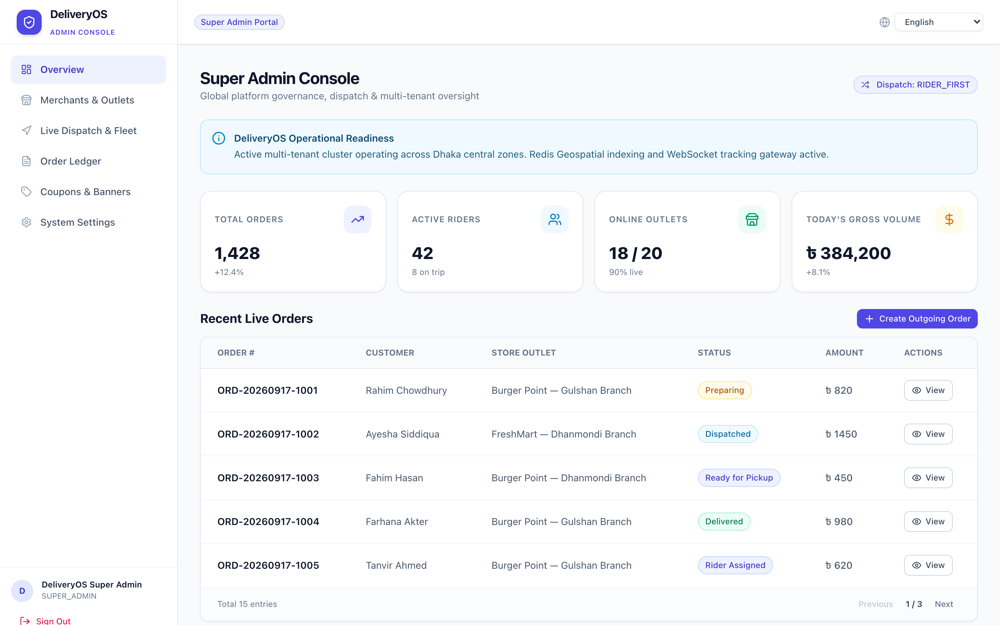

# DeliveryOS — Product & System Overview

An executive guide explaining what DeliveryOS is, how it works, who it is built for, the technologies behind it, and how it can be white-labeled.

---

## Executive Summary Table

| Question | Answer |
| :--- | :--- |
| **Product Name** | **DeliveryOS** |
| **Product Category** | **On-Demand Hyperlocal Delivery & Quick-Commerce (Q-Commerce) Platform**<br>*(An all-in-one delivery engine similar to Foodpanda, Uber Eats, or Instacart)* |
| **What Does the Product Do?** | Handles the complete lifecycle of on-demand local ordering and delivery:<br>• **Customers** discover nearby stores, customize items, and place orders.<br>• **Merchants** receive orders on a kitchen screen, set prep timers, and pack items.<br>• **Couriers** receive trip alerts on their phones, pick up packages, and deliver via live GPS.<br>• **Operations Teams** manage dispatch, customer refunds, fleet cash limits, and platform earnings from a central dashboard. |
| **Who the Product Is For** | • **Delivery Startups**: Companies building a regional food, grocery, or parcel delivery business.<br>• **Restaurant Chains & Cloud Kitchens**: Food brands wanting their own direct ordering app to avoid 25%–35% third-party marketplace commissions.<br>• **Supermarkets & Pharmacies**: Retailers needing fast multi-weight basket shopping and local delivery.<br>• **Fleet & Logistics Operators**: Courier companies managing riders, shifts, and cash collections. |
| **Technology Used** | • **Client Apps (Customer & Rider)**: Flutter (Dart) — one cross-platform codebase running natively on iOS and Android, with inherent support to export/provide a responsive Web version in the future.<br>• **Web Portals (Admin & Store)**: React 18, Vite, and TailwindCSS — fast, lightweight browser dashboards.<br>• **Backend Engine**: NestJS (TypeScript), Node.js, and Socket.IO — handles business rules, APIs, and real-time updates.<br>• **Databases & Telemetry**: PostgreSQL 16 with PostGIS (for map radii and location matching) and Redis 7.2 (for live driver coordinates and instant locks).<br>• **Infrastructure**: Nginx and Docker — containerized, reliable deployment. |
| **White-Labeling Possible?** | **Yes, 100% white-label ready.**<br>Any company can brand this platform as their own without rewriting code:<br>• Update brand colors and logos in a single settings file across all apps.<br>• Rename, add, or toggle business categories (Restaurants, Groceries, Pharmacies) directly from the admin screen.<br>• Built-in multi-currency and multi-language support (English, Bengali, and Arabic with Right-to-Left layout). |

---

## 1. Product Name & Positioning

* **Official Name**: DeliveryOS
* **Tagline**: Enterprise Multi-Vendor Delivery Engine for Food, Grocery, Super Shop & Retail
* **What it replaces**: Instead of stitching together separate, fragmented tools for ordering, kitchen tickets, driver tracking, and admin controls, DeliveryOS provides one unified system where every piece connects out of the box.

---

## 2. Product Category

DeliveryOS belongs to the **Hyperlocal On-Demand Delivery & Quick-Commerce (Q-Commerce)** category. 

It is a **multi-vendor marketplace combined with last-mile fleet dispatch software**. It handles businesses where goods must be ordered, prepared, and delivered to a customer's doorstep within 15 to 45 minutes.

---

## 3. What Does the Product Do? (Detailed Workflow with System Screenshots)

The platform runs the entire delivery workflow across four dedicated interfaces connected to a central real-time engine:

```text
┌─────────────────┐       ┌─────────────────┐       ┌─────────────────┐
│  Customer App   │  ───▶ │  Vendor Portal  │  ───▶ │    Rider App    │
│ (Order & Track) │       │ (Kitchen / KDS) │       │ (Pickup & Nav)  │
└─────────────────┘       └─────────────────┘       └─────────────────┘
         ▲                         ▲                         ▲
         │                         │                         │
         └───────────────── 🖥️ Super Admin ──────────────────┘
                            (Control Tower)
```

---

### Step 1: Customer Discovery & Ordering (Customer App — iOS & Android)

<p align="center">
  
  <br>
  <em>Figure 1: Customer Mobile App — Hyperlocal outlet discovery, promotional banners, multi-store category chips, and live restaurant catalog.</em>
</p>

* **Location-Based Discovery**: Customers open the app and instantly see stores within their exact delivery radius (calculated using GPS distance).
* **Multi-Store Categories**: Browse restaurants, grocery stores, supermarkets, or pharmacies.
* **Customizable Menus**: Select items, choose sizes or variants (e.g., Small, Medium, Large), and add items to a cart.
* **Protected Cart**: If a customer already has items from Store A and tries adding an item from Store B, the app detects the conflict and asks whether to replace the cart, preventing messy multi-store orders.
* **Flexible Checkout & Payments**: Customers can choose between Home Delivery or Takeaway, apply promo discount codes, and pay using online cards, mobile wallets, or Cash on Delivery (COD).
* **Live Order Tracking**: After ordering, customers watch their order move through 6 live stages on a map with estimated arrival times (ETA).

---

### Step 2: Store Acceptance & Preparation (Vendor Web Portal)

<p align="center">
  
  <br>
  <em>Figure 2: Vendor Portal — Live Kitchen Display System (KDS), preparation countdown timers, multi-lane order progression, and real-time stock toggles.</em>
</p>

* **Live Kitchen Display (KDS)**: Tablet-friendly dashboard with sound alerts whenever a new order arrives.
* **Prep Countdown**: Kitchen staff accept the order and pick an estimated preparation time (e.g., 15 minutes).
* **Inventory Control**: Staff can flip a switch to mark any dish or item as "Sold Out" instantly so customers cannot order unavailable items.
* **Rush Hour Pause**: If the kitchen gets overwhelmed, staff can temporarily pause incoming orders for 15, 30, or 60 minutes.
* **Daily Sales Reports**: View daily sales, itemized receipts, and payout breakdowns.

---

### Step 3: Courier Dispatch & Delivery (Rider App — iOS & Android)

<p align="center">
  
  <br>
  <em>Figure 3: Rider Fleet App — Online/Offline duty toggle, incoming broadcast trip cards, turn-by-turn destination navigation, and live cash-in-hand tracking.</em>
</p>

* **Duty Toggle**: Riders go "Online" when ready to work, streaming their GPS location to the server.
* **Trip Alerts**: When an order is ready, nearby riders receive an alert showing the pickup store and drop-off destination.
* **Clear Route Navigation**: Riders accept the order, tap to open navigation to the store, pick up the package, and head to the customer.
* **Handoff Verification & Cash Collection**: Riders verify handoff with the customer, record cash collected for Cash on Delivery orders, and complete the job.
* **Earnings & Cash Safety**: Riders see their daily/weekly earnings and a live counter of cash collected. If a rider holds too much cash, the system locks new dispatches until they submit a cash deposit receipt to the admin.

---

### Step 4: Central Operations Control (Super Admin Portal)

<p align="center">
  
  <br>
  <em>Figure 4: Super Admin Operations Console — Live city dispatch radar, real-time rider tracking map, store management, and financial overview.</em>
</p>

* **Live Dispatch Radar**: Interactive map showing all active riders, stores, and pending orders in the city.
* **Manual Overrides**: Dispatchers can reassign orders to specific drivers, cancel problematic orders, or trigger automatic payment refunds.
* **Store & Brand Management**: Onboard new merchant brands, set outlet delivery radiuses, and assign dispatch rules:
  * *Rider-First*: Dispatches the driver early so food is picked up the second it leaves the stove (ideal for hot food).
  * *Vendor-First*: Calls the driver only after the store finishes packaging (ideal for groceries and retail).
* **Rider Approvals & Limits**: Review rider documents, approve accounts, and set maximum cash-in-hand limits.
* **Promotions & Coupons**: Create discount codes (percentage or flat discount) and upload promotional banner ads.

---

## 4. Who the Product Is For

| Target Audience | Why They Need DeliveryOS |
| :--- | :--- |
| **On-Demand Delivery Startups** | Founders wanting to launch a local food or grocery delivery service in their city without spending months building software from scratch. |
| **Restaurant Chains & Cloud Kitchens** | Multi-branch food brands wanting their own branded app to build direct customer loyalty and stop paying 25%–35% commissions to food aggregator apps. |
| **Supermarket & Grocery Networks** | Retail chains needing fast basket shopping, multi-weight items (`kg`, `500g`, `pack`), and immediate store-to-door delivery. |
| **Fleet & Logistics Providers** | Courier operators who have a fleet of motorbikes or bicycles and need an automated system to assign deliveries, track drivers, and manage cash collections. |

---

## 5. Technology Used to Build the Product

The tech stack was selected for three practical reasons: high performance, real-time speed, and cross-platform simplicity.

| Layer | Technologies | Practical Purpose |
| :--- | :--- | :--- |
| **Client Apps (Mobile & Web-Ready)** | **Flutter (Dart ^3.8)** | One unified codebase powers both the Customer App and the Rider App on Android and iOS. Because it is built with Flutter, the same codebase can readily be extended to provide a responsive Web / PWA version in the future with minimal adaptation. Delivers 60 FPS animations, smooth maps, and fast loading. |
| **Mobile State & Network** | **Riverpod 3 & Dio** | Manages application state reliably without memory leaks and handles network calls with automatic token refresh. |
| **Web Dashboards** | **React 18, Vite & TailwindCSS** | Provides responsive web dashboards for Store Managers and Super Admins. Loads in under a second in any standard web browser. |
| **Live Dispatch Map** | **Leaflet & OpenStreetMap** | Powers the operations radar map without requiring expensive proprietary map licensing. |
| **Backend Core** | **NestJS 10 (TypeScript & Node.js)** | An organized enterprise server framework that runs all business logic, order rules, calculations, and security checks. |
| **Real-Time Gateway** | **Socket.IO 4.x** | Pushes live updates instantly (order status, kitchen chimes, live driver location) without requiring users to refresh screens. |
| **Primary Database** | **PostgreSQL 16 + PostGIS 3.4** | Stores all accounts, orders, and products safely. The PostGIS extension handles spatial GPS calculations (e.g., "is this customer within 5 km of this store?"). |
| **Cache & GPS Tracker** | **Redis 7.2** | High-speed memory store that tracks live rider GPS coordinates and prevents two riders from accepting the exact same order at the same moment. |
| **Edge & Deployment** | **Docker & Nginx** | All pieces run inside clean, isolated Docker containers behind an Nginx reverse proxy, making deployments predictable on any cloud server. |

---

## 6. Can the Product Be White-Labeled?

### **Yes — DeliveryOS is built from the ground up for white-labeling.**

White-labeling means another company can put their own brand, colors, and business rules on this software and launch it as their own product. DeliveryOS supports this cleanly across several layers:

### 1. Brand Colors & Styling (Zero Hardcoded Colors)
* The mobile apps use a centralized design token system (`AppColors`). Changing the primary brand color from red to green or blue requires updating **one single file**.
* The web portals use TailwindCSS theme configuration (`brand`, `primary`, `surface`). Changing your company palette takes seconds.

### 2. Business Types Are Configurable Data (Not Hardcoded Code)
* You are not locked into food delivery. Business verticals (Restaurant, Grocery, Pharmacy, Coffee Shop, Electronics, etc.) are managed dynamically from the Super Admin dashboard.
* You can run a pure food delivery app, a pure pharmacy drop service, or a combined super-app without modifying application source code.

### 3. Multi-Currency & Multi-Language Ready
* **Currencies**: Built with deterministic financial accounting supporting multiple currencies (currently supporting `BDT ৳` and `SAR ر.س`, easily configured for `USD $`, `AED د.إ`, `EUR €`, etc.).
* **Languages**: Full translation system supporting English, Bengali, and Arabic. Arabic includes native **Right-to-Left (RTL)** layout flipping across the entire user interface. Adding another language (e.g., Spanish, French, Urdu) requires adding a translation file.

### 4. Separate App Packages
* The Customer App, Rider App, Vendor Portal, and Admin Portal are independent projects. Each has its own app icon, splash screen, package name (e.g., `com.yourbrand.customer`), and title.

### 5. Pluggable Payment & SMS Providers
* The payment service is modular. While currently configured with SSLCommerz and Cash on Delivery, it can be swapped for Stripe, Razorpay, Moyasar, or any regional gateway.
* SMS OTP verification is modular and can connect to any SMS provider (SSL Wireless, Twilio, AWS SNS, etc.).

### 6. Multi-Platform Extensibility (Web Version Ready)
* Because the customer and courier client apps are built with **Flutter**, they share a single unified UI and business logic codebase across platforms.
* In addition to native iOS and Android builds, the Flutter foundation allows easily exporting and deploying a **responsive Web or PWA version** in the future without rewriting core ordering workflows.

---

## Summary
**DeliveryOS** is a turnkey, production-ready on-demand delivery platform. It gives businesses the exact infrastructure used by multi-billion dollar delivery apps—fully customizable, multi-vertical, and ready to deploy under any brand name.
