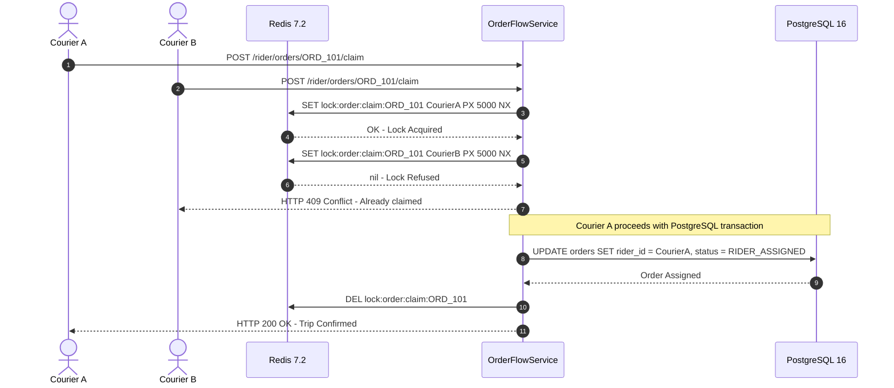

# ADR-004: High-Concurrency Order Dispatch Claiming via Redis Atomic Distributed Mutex

## Status
**Accepted** (2026-09-20)

---

## Context & Problem Statement
When an order is broadcast to nearby couriers in the `riders_pool`, multiple riders receive push notifications simultaneously. Under high volume, multiple couriers may tap "Accept Order" within milliseconds of each other.

Without atomic concurrency control:
1. Multiple worker processes read `order.riderId == null` simultaneously.
2. Concurrent database updates succeed or create deadlocks.
3. Multiple couriers arrive at the merchant claiming the same order.

---

## Decision Drivers
- **Strict Single-Winner Guarantee**: Exactly one courier must secure the dispatch claim.
- **Immediate Rejection Feedback**: Losing couriers must receive an immediate `409 Conflict` response with zero server lag.
- **Deadlock Protection**: If a backend process crashes mid-claim, locks must release automatically.
- **Sub-5ms Lock Latency**: Claiming operations cannot introduce perceptible latency in the mobile app.

---

## Considered Options
1. **Pessimistic Database Locking (`SELECT FOR UPDATE`)**: Lock rows at the relational database level. *(Rejected: High row lock contention under peak load)*.
2. **Optimistic Concurrency Control (Version column)**: Check entity version at write. *(Rejected: Requires rollbacks and multiple database roundtrips)*.
3. **Redis Atomic Distributed Mutex (`SET key val PX 5000 NX`) (Chosen)**: In-memory single-cycle atomic lock before database commit.

---

## Decision Outcome
Chosen option: **Redis Atomic Distributed Mutex**.



### Positive Consequences
- **Absolute Concurrency Safety**: Guaranteed single assignment regardless of concurrent claim spikes.
- **Zero Database Load for Rejected Claims**: Non-winning requests are rejected in $<1$ ms by Redis before touching PostgreSQL.
- **Self-Healing TTL**: The 5-second TTL (`PX 5000`) guarantees lock expiration even if the worker container abruptly crashes.

### Negative Consequences & Mitigations
- *Trade-off*: Dependency on Redis availability for order claiming.
- *Mitigation*: Docker Compose health checks and automated restarts ensure high Redis uptime.

---

## Technical Implementation Details
Implemented in [`order-flow.service.ts`](../../services/backend_api/src/modules/order-flow/order-flow.service.ts):
```typescript
// 1. Invariant Checks: Rider must be online, admin-approved, and active
if (!rider || !rider.isOnline) throw new BadRequestException('Rider is offline or profile not found');
if (!rider.isApproved) throw new BadRequestException('Rider account is pending admin approval');
if (rider.user?.status !== AccountStatus.ACTIVE) throw new BadRequestException('Rider account is suspended or inactive');

// 2. Active Trip Guard
const alreadyBusy = await this.redis.get(`rider:active_order:${rider.id}`);
if (alreadyBusy) throw new BadRequestException('You already have an active assigned delivery trip');

// 3. Redis Distributed Mutex (10-second TTL)
const lockKey = `lock:order_claim:${orderId}`;
const acquired = await this.redis.acquireLock(lockKey, rider.id, 10);
if (!acquired) {
  throw new ConflictException('This order is currently being claimed by another rider.');
}

try {
  const updatedOrder = await this.prisma.$transaction(async (tx) => {
    // Assert order unclaimed & check COD cash safety limit
    if (order.paymentMethod === PaymentMethod.CASH_ON_DELIVERY) {
      if (Number(rider.cashInHand) + Number(order.totalAmount) > Number(rider.maxCashLimit)) {
        throw new BadRequestException('Order exceeds rider cash-in-hand limit. Please deposit cash before claiming.');
      }
    }
    // Update order with riderId and status
    return await tx.order.update({ where: { id: orderId }, data: { riderId: rider.id, status: newStatus } });
  });

  // Mark rider as busy in Redis AFTER DB transaction commits successfully
  await this.redis.set(`rider:active_order:${rider.id}`, orderId);
  return updatedOrder;
} finally {
  await this.redis.releaseLock(lockKey, rider.id);
}
```

---

## Dispatch Escalation Architecture (Phase 2)
To prevent unassigned orders from starving when nearby couriers do not claim them promptly, the dispatch engine implements an autonomous 2-tier escalation loop scanning unassigned orders every 30 seconds:

```
┌────────────────────────────────────────────────────────────────────────┐
│  Tier 0 (T = 0s): Initial Broadcast                                   │
│  - Proximity radius: 3.0 km                                            │
│  - Push FCM alert + Socket event [dispatch:broadcast] to riders_pool   │
└───────────────────────────────────┬────────────────────────────────────┘
                                    │ Unclaimed after > 90s
                                    ▼
┌────────────────────────────────────────────────────────────────────────┐
│  Tier 1 Escalation (T > 90s): Expanded Proximity Broadcast             │
│  - Radius expanded: 6.0 km                                             │
│  - Idempotent Redis key: dispatch:escalated:{orderId}:tier1 (TTL 10m)  │
│  - Re-broadcasts via WebSockets & FCM notification                     │
└───────────────────────────────────┬────────────────────────────────────┘
                                    │ Unclaimed after > 180s
                                    ▼
┌────────────────────────────────────────────────────────────────────────┐
│  Tier 2 Escalation (T > 180s): Super Admin Emergency Radar Alert       │
│  - Idempotent Redis key: dispatch:escalated:{orderId}:tier2 (TTL 10m)  │
│  - Emits [dispatch:escalated] to admin_hq socket room                  │
│  - Displays high-priority warning banner in Admin Dispatch Live Radar  │
│  - Allows dispatcher manual courier override                           │
└────────────────────────────────────────────────────────────────────────┘
```

---

## Fleet Invariants & Push Rings

1. **Database In-Flight Backstop**: In addition to Redis busy locks, the claim transaction verifies that the courier holds zero active orders in PostgreSQL (`[RIDER_ASSIGNED, ACCEPTED, PREPARING, READY_FOR_PICKUP, DISPATCHED]`), preventing double-assignment if Redis markers expire or flush.
2. **Assignment-Guarded Pickup**: `pickupOrder` strictly verifies caller assignment (`order.riderId === rider.id`) with status-conditional updates, preventing unassigned order adoption.
3. **Admin Force-Assignment Validation**: Admin manual assignment validates that the target courier is approved, active, on duty, has zero concurrent trips, and that online orders are verified `PAID`.
4. **Geo-Targeted Push Rings**: Socket dispatch broadcasts pool-wide, while high-priority FCM notifications target couriers within proximity rings: 5 km (Tier 0), 6 km (Tier 1), and 10 km (Tier 2) using Redis geospatial queries (`GEOSEARCH`).

---

## Compliance & Verification
- **Distributed Mutex Test**: Verified via `npm run test:dispatch` (`scripts/test-dispatch-fsm.ts`) asserting concurrent rider claims result in exactly 1 winner (200 OK) and rejections (409 Conflict).
- **Escalation & FCM Test**: Verified via `npm run test:escalation` (`scripts/test-fcm-notifications.ts`) asserting Tier 1 radius expansion and Tier 2 `admin_hq` room escalation.
- **Courier UI error handling**: Handled via Riverpod exception interception in [`trip_provider.dart`](../../apps/rider_app/lib/features/trips/providers/trip_provider.dart).
- **Admin Fleet Map Radar**: Verified in [`LiveFleetMap.tsx`](../../apps/admin_portal/src/components/dispatch/LiveFleetMap.tsx) showing real-time rider pins and escalation badges.
