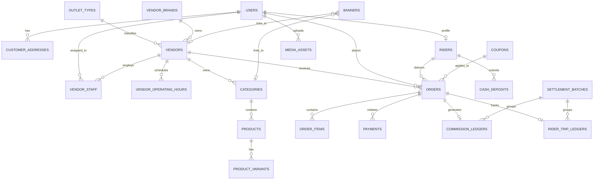

# 02 — Database Schema & Data Models

Relational entity relationships, data dictionary, PostgreSQL 16 DDL with PostGIS spatial extensions, performance indexes, and spatial query specifications for DeliveryOS.

---

## 1. Relational Entity Relationship Diagram (ERD)



---

## 2. Granular Data Entities Catalog

1. **`users`**: Platform user accounts across all roles (`SUPER_ADMIN`, `VENDOR_ADMIN`, `RIDER`, `CUSTOMER`). Contains phone, name, email, account status, suspension reason, and FCM device tokens.
2. **`customer_addresses`**: Geocoded delivery locations linked to users. Contains label (`Home`, `Work`, `Other`), address details, and `latitude`/`longitude` float coordinates (PostGIS geography computed at query time).
3. **`outlet_types`**: Admin-managed business types (e.g. Restaurant, Grocery, Pharmacy). Toggling `is_active` off hides every outlet of the type from customer discovery — the soft business control; deletes are guarded while outlets remain assigned (ADR-019).
4. **`vendor_brands`**: Top-level merchant brand entities for multi-branch chains.
5. **`vendors`**: Physical merchant outlets — **always owned by a brand** (`brand_id NOT NULL`, ADR-017) and **always classified by an outlet type** (`type_id NOT NULL`, ADR-019). Stores `latitude`/`longitude` coordinates, commission rate, delivery radius (km), operational status, per-outlet dispatch flow mode, and default prep time.
6. **`vendor_staff`**: Junction table binding users to outlets or brands with permission scopes (`PARTICULAR_OUTLET` vs `ALL_OUTLETS_MASTER`).
7. **`vendor_operating_hours`**: Weekly 7-day schedule (0=Sun to 6=Sat) with open/close times and closed checkboxes.
8. **`categories`**: Menu categories scoped to an outlet (`vendor_id NOT NULL`).
9. **`products`**: Menu items with base price, description, unit type (`piece`, `kg`, etc.), and stock availability flag.
10. **`product_variants`**: Single-choice variants (e.g. sizes, weights) with absolute prices (first variant anchors the display price, ADR-017).
11. **`banners`**: Promotional homepage hero banners with active scheduling and target deep links (`OUTLET`, `CATEGORY`, `EXTERNAL`, `INTERNAL`).
12. **`coupons`**: Discount promo codes with flat or percentage values, spend thresholds, ceilings, and usage limits.
13. **`riders`**: Delivery courier profiles linked to users. Stores vehicle type, online duty state, approval state, cash-in-hand balance, max cash safety limit, and last known `latitude`/`longitude`.
14. **`system_settings`**: Global platform configuration keys (JSONB) for dispatch timing, fee pricing mode, delivery economics, and region parameters.
15. **`orders`**: Master order record containing order number, immutable flow-mode snapshot (ADR-019), snapshots of address and customer phone, status FSM, line item totals, timestamps, and notes.
16. **`order_items`**: Line items within an order with snapshots of product name, unit price, quantity, and variant.
17. **`settlement_batches`**: Weekly administrative financial payout cycles grouping completed orders.
18. **`commission_ledgers`**: Double-entry ledger recording gross food totals, platform commission deductions, and net vendor payables per order.
19. **`rider_trip_ledgers`**: Ledger tracking courier trip earnings and doorstep COD collections per order.
20. **`cash_deposits`**: Audit records of physical cash deposits made by couriers at central hubs (`cash_deposit_status` enum: `PENDING_APPROVAL` | `APPROVED` | `REJECTED`).
21. **`payments`**: Transaction records for online payment gateway sessions (SSLCommerz, Sandbox) and cryptographic webhooks.
22. **`media_assets`**: Central media library registrations for every uploaded image (ADR-016).

---

## 3. Production PostgreSQL DDL & Spatial Schema

> **Source of truth**: `services/backend_api/prisma/schema.prisma` + the baseline migration `prisma/migrations/0_init/migration.sql` (ADR-012). The DDL below is the logical reference model. Coordinates persist as `DOUBLE PRECISION` lat/lng pairs; PostGIS geography is expressed at query time over `GIST` expression indexes.

```sql
-- 1. Initialize Extensions
CREATE EXTENSION IF NOT EXISTS "uuid-ossp";
CREATE EXTENSION IF NOT EXISTS "pgcrypto";
CREATE EXTENSION IF NOT EXISTS "postgis";

-- 2. Enumerated Types (managed by Prisma)
CREATE TYPE user_role AS ENUM ('SUPER_ADMIN', 'VENDOR_ADMIN', 'RIDER', 'CUSTOMER');
CREATE TYPE account_status AS ENUM ('PENDING_APPROVAL', 'ACTIVE', 'SUSPENDED');
CREATE TYPE permission_scope AS ENUM ('PARTICULAR_OUTLET', 'ALL_OUTLETS_MASTER');
CREATE TYPE order_flow_mode AS ENUM ('RIDER_FIRST', 'VENDOR_FIRST');
CREATE TYPE order_status AS ENUM (
  'PLACED',
  'RIDER_ASSIGNED',
  'ACCEPTED', -- Schema enum value: runtime engine transitions directly to PREPARING (ADR-002)
  'PREPARING',
  'READY_FOR_PICKUP',
  'DISPATCHED',
  'DELIVERED',
  'CANCELLED'
);
CREATE TYPE payment_method AS ENUM ('CASH_ON_DELIVERY', 'ONLINE_GATEWAY');
CREATE TYPE payment_status AS ENUM ('PENDING', 'PAID', 'REFUNDED', 'FAILED');
CREATE TYPE settlement_status AS ENUM ('PENDING', 'PROCESSING', 'SETTLED');
CREATE TYPE cash_deposit_status AS ENUM ('PENDING_APPROVAL', 'APPROVED', 'REJECTED');
CREATE TYPE discount_type AS ENUM ('PERCENTAGE', 'FLAT');
CREATE TYPE banner_link_type AS ENUM ('OUTLET', 'CATEGORY', 'EXTERNAL', 'INTERNAL');
-- Note: dispatch timing (rider search timeout, stale TTL) and the delivery-fee
-- engine live in the `system_settings` JSONB keys `dispatch_config` /
-- `delivery_fee_config`. The flow-mode *sequence* is per outlet
-- (`vendors.order_flow_mode`), snapshotted onto every order at checkout.

-- 3. Users Table
CREATE TABLE users (
    id UUID PRIMARY KEY DEFAULT uuid_generate_v4(),
    phone VARCHAR(20) UNIQUE NOT NULL,
    full_name VARCHAR(100) NOT NULL,
    email VARCHAR(100),
    role user_role NOT NULL DEFAULT 'CUSTOMER',
    status account_status NOT NULL DEFAULT 'ACTIVE',
    suspension_reason TEXT,
    fcm_token TEXT,
    device_platform VARCHAR(20),
    created_at TIMESTAMP WITH TIME ZONE DEFAULT CURRENT_TIMESTAMP,
    updated_at TIMESTAMP WITH TIME ZONE DEFAULT CURRENT_TIMESTAMP
);
CREATE INDEX idx_users_role_status ON users(role, status);

-- 4. Customer Addresses Table (Float Coordinates + Expression GIST)
CREATE TABLE customer_addresses (
    id UUID PRIMARY KEY DEFAULT uuid_generate_v4(),
    user_id UUID NOT NULL REFERENCES users(id) ON DELETE CASCADE,
    label VARCHAR(30) NOT NULL DEFAULT 'Home',
    address_line TEXT NOT NULL,
    building_floor VARCHAR(100),
    delivery_note TEXT,
    latitude DOUBLE PRECISION NOT NULL,
    longitude DOUBLE PRECISION NOT NULL,
    is_default BOOLEAN DEFAULT FALSE,
    created_at TIMESTAMP WITH TIME ZONE DEFAULT CURRENT_TIMESTAMP
);
CREATE INDEX idx_customer_addresses_geo ON customer_addresses USING GIST (CAST(ST_SetSRID(ST_MakePoint(longitude, latitude), 4326) AS geography));
CREATE INDEX idx_customer_addresses_user_id ON customer_addresses(user_id);

-- 5. Outlet Types (ADR-019: admin-managed business types)
CREATE TABLE outlet_types (
    id UUID PRIMARY KEY DEFAULT uuid_generate_v4(),
    name VARCHAR(100) UNIQUE NOT NULL,
    slug VARCHAR(100) UNIQUE NOT NULL,
    is_active BOOLEAN NOT NULL DEFAULT TRUE,
    sort_order INT NOT NULL DEFAULT 0,
    created_at TIMESTAMP WITH TIME ZONE DEFAULT CURRENT_TIMESTAMP,
    updated_at TIMESTAMP WITH TIME ZONE DEFAULT CURRENT_TIMESTAMP
);
CREATE INDEX idx_outlet_types_active_sort ON outlet_types(is_active, sort_order);

-- 6. Vendor Brands Table (For Multi-Outlet Chains)
CREATE TABLE vendor_brands (
    id UUID PRIMARY KEY DEFAULT uuid_generate_v4(),
    name VARCHAR(150) NOT NULL,
    logo_url TEXT,
    created_at TIMESTAMP WITH TIME ZONE DEFAULT CURRENT_TIMESTAMP
);

-- 7. Vendors / Outlets Table (Float Coordinates + Expression GIST & Radius)
CREATE TABLE vendors (
    id UUID PRIMARY KEY DEFAULT uuid_generate_v4(),
    brand_id UUID NOT NULL REFERENCES vendor_brands(id),
    type_id UUID NOT NULL REFERENCES outlet_types(id),
    name VARCHAR(150) NOT NULL,
    contact_phone VARCHAR(20) NOT NULL,
    logo_url TEXT,
    banner_url TEXT,
    latitude DOUBLE PRECISION NOT NULL,
    longitude DOUBLE PRECISION NOT NULL,
    address_text TEXT NOT NULL,
    commission_rate NUMERIC(5, 2) NOT NULL DEFAULT 15.00,
    delivery_radius_km NUMERIC(5, 2) NOT NULL DEFAULT 5.00,
    default_prep_time_minutes INT NOT NULL DEFAULT 20,
    is_active BOOLEAN DEFAULT TRUE,
    is_busy BOOLEAN DEFAULT FALSE,
    order_flow_mode order_flow_mode NOT NULL DEFAULT 'RIDER_FIRST',
    created_at TIMESTAMP WITH TIME ZONE DEFAULT CURRENT_TIMESTAMP,
    updated_at TIMESTAMP WITH TIME ZONE DEFAULT CURRENT_TIMESTAMP
);
CREATE INDEX idx_vendors_geo ON vendors USING GIST (CAST(ST_SetSRID(ST_MakePoint(longitude, latitude), 4326) AS geography));
CREATE INDEX idx_vendors_brand_id ON vendors(brand_id);
CREATE INDEX idx_vendors_type_id ON vendors(type_id);
CREATE INDEX idx_vendors_is_active ON vendors(is_active);

-- 8. Vendor Staff & Permission Scopes
CREATE TABLE vendor_staff (
    id UUID PRIMARY KEY DEFAULT uuid_generate_v4(),
    user_id UUID NOT NULL REFERENCES users(id) ON DELETE CASCADE,
    vendor_id UUID REFERENCES vendors(id) ON DELETE CASCADE,
    brand_id UUID REFERENCES vendor_brands(id) ON DELETE CASCADE,
    scope permission_scope NOT NULL DEFAULT 'PARTICULAR_OUTLET',
    is_active BOOLEAN DEFAULT TRUE,
    created_at TIMESTAMP WITH TIME ZONE DEFAULT CURRENT_TIMESTAMP,
    UNIQUE(user_id, vendor_id)
);
CREATE INDEX idx_vendor_staff_user_id ON vendor_staff(user_id);

-- 9. Vendor Operating Hours Table
CREATE TABLE vendor_operating_hours (
    id UUID PRIMARY KEY DEFAULT uuid_generate_v4(),
    vendor_id UUID NOT NULL REFERENCES vendors(id) ON DELETE CASCADE,
    day_of_week SMALLINT NOT NULL CHECK (day_of_week BETWEEN 0 AND 6),
    open_time VARCHAR(8) NOT NULL,   -- "09:00:00" region-time strings
    close_time VARCHAR(8) NOT NULL,
    is_closed BOOLEAN DEFAULT FALSE,
    UNIQUE(vendor_id, day_of_week)
);

-- 10. Categories Table (outlet-scoped; no global categories)
CREATE TABLE categories (
    id UUID PRIMARY KEY DEFAULT uuid_generate_v4(),
    vendor_id UUID NOT NULL REFERENCES vendors(id) ON DELETE CASCADE,
    name VARCHAR(100) NOT NULL,
    image_url TEXT,
    sort_order INT DEFAULT 0,
    is_active BOOLEAN DEFAULT TRUE
);
CREATE INDEX idx_categories_vendor_id ON categories(vendor_id);

-- 11. Products / Items Table
CREATE TABLE products (
    id UUID PRIMARY KEY DEFAULT uuid_generate_v4(),
    vendor_id UUID NOT NULL REFERENCES vendors(id) ON DELETE CASCADE,
    category_id UUID REFERENCES categories(id) ON DELETE SET NULL,
    name VARCHAR(150) NOT NULL,
    description TEXT,
    base_price NUMERIC(10, 2) NOT NULL CHECK (base_price >= 0),
    unit_type VARCHAR(20) DEFAULT 'piece',
    image_url TEXT,
    is_in_stock BOOLEAN DEFAULT TRUE,
    sort_order INT DEFAULT 0,
    created_at TIMESTAMP WITH TIME ZONE DEFAULT CURRENT_TIMESTAMP,
    updated_at TIMESTAMP WITH TIME ZONE DEFAULT CURRENT_TIMESTAMP
);
CREATE INDEX idx_products_vendor ON products(vendor_id);
CREATE INDEX idx_products_vendor_stock ON products(vendor_id, is_in_stock);
CREATE INDEX idx_products_category ON products(category_id);

-- 12. Product Variants Table (absolute pricing, ADR-017)
CREATE TABLE product_variants (
    id UUID PRIMARY KEY DEFAULT uuid_generate_v4(),
    product_id UUID NOT NULL REFERENCES products(id) ON DELETE CASCADE,
    name VARCHAR(100) NOT NULL,
    price NUMERIC(10, 2) NOT NULL,
    sort_order INT DEFAULT 0,
    is_in_stock BOOLEAN DEFAULT TRUE
);
CREATE INDEX idx_product_variants_product ON product_variants(product_id);

-- 13. Promotional Banners Table
CREATE TABLE banners (
    id UUID PRIMARY KEY DEFAULT uuid_generate_v4(),
    title VARCHAR(150) NOT NULL,
    image_url TEXT NOT NULL,
    link_type banner_link_type NOT NULL DEFAULT 'OUTLET',
    target_id VARCHAR(100),
    target_url VARCHAR(500),
    sort_order INT DEFAULT 0,
    is_active BOOLEAN DEFAULT TRUE,
    starts_at TIMESTAMP WITH TIME ZONE DEFAULT CURRENT_TIMESTAMP,
    ends_at TIMESTAMP WITH TIME ZONE,
    created_at TIMESTAMP WITH TIME ZONE DEFAULT CURRENT_TIMESTAMP
);
CREATE INDEX idx_banners_is_active ON banners(is_active);

-- 14. Promotional Coupons Table
CREATE TABLE coupons (
    id UUID PRIMARY KEY DEFAULT uuid_generate_v4(),
    code VARCHAR(50) UNIQUE NOT NULL,
    description TEXT,
    discount_type discount_type NOT NULL DEFAULT 'PERCENTAGE',
    discount_value NUMERIC(10, 2) NOT NULL,
    min_order_amount NUMERIC(10, 2) DEFAULT 0.00,
    max_discount_amount NUMERIC(10, 2),
    usage_limit INT DEFAULT 1000,
    current_uses INT DEFAULT 0,
    valid_from TIMESTAMP WITH TIME ZONE NOT NULL,
    valid_to TIMESTAMP WITH TIME ZONE NOT NULL,
    is_active BOOLEAN DEFAULT TRUE,
    created_at TIMESTAMP WITH TIME ZONE DEFAULT CURRENT_TIMESTAMP
);

-- 15. Riders Table
CREATE TABLE riders (
    id UUID PRIMARY KEY DEFAULT uuid_generate_v4(),
    user_id UUID UNIQUE NOT NULL REFERENCES users(id) ON DELETE CASCADE,
    vehicle_type VARCHAR(50) NOT NULL DEFAULT 'motorcycle',
    is_online BOOLEAN DEFAULT FALSE,
    is_approved BOOLEAN DEFAULT TRUE,
    cash_in_hand NUMERIC(10, 2) DEFAULT 0.00,
    max_cash_limit NUMERIC(10, 2) DEFAULT 5000.00,
    latitude DOUBLE PRECISION,
    longitude DOUBLE PRECISION,
    updated_at TIMESTAMP WITH TIME ZONE DEFAULT CURRENT_TIMESTAMP
);
CREATE INDEX idx_riders_geo ON riders USING GIST (CAST(ST_SetSRID(ST_MakePoint(longitude, latitude), 4326) AS geography));
CREATE INDEX idx_riders_is_online ON riders(is_online);
CREATE INDEX idx_riders_is_approved ON riders(is_approved);

-- 16. System Settings Table
CREATE TABLE system_settings (
    key VARCHAR(50) PRIMARY KEY,
    value JSONB NOT NULL,
    description TEXT,
    updated_at TIMESTAMP WITH TIME ZONE DEFAULT CURRENT_TIMESTAMP
);

-- 17. Orders Table (flow-mode snapshot is immutable after checkout)
CREATE TABLE orders (
    id UUID PRIMARY KEY DEFAULT uuid_generate_v4(),
    order_number VARCHAR(20) UNIQUE NOT NULL,
    customer_id UUID NOT NULL REFERENCES users(id),
    vendor_id UUID NOT NULL REFERENCES vendors(id),
    rider_id UUID REFERENCES riders(id),
    coupon_id UUID REFERENCES coupons(id) ON DELETE SET NULL,
    status order_status NOT NULL DEFAULT 'PLACED',
    order_flow_mode order_flow_mode NOT NULL DEFAULT 'RIDER_FIRST',

    subtotal NUMERIC(10, 2) NOT NULL,
    coupon_discount NUMERIC(10, 2) NOT NULL DEFAULT 0.00,
    delivery_fee NUMERIC(10, 2) NOT NULL,
    tax_amount NUMERIC(10, 2) NOT NULL DEFAULT 0.00,
    total_amount NUMERIC(10, 2) NOT NULL,

    payment_method payment_method NOT NULL DEFAULT 'CASH_ON_DELIVERY',
    payment_status payment_status NOT NULL DEFAULT 'PENDING',

    delivery_address_snapshot JSONB NOT NULL,
    customer_phone_snapshot VARCHAR(20) NOT NULL,

    prep_time_minutes INT,
    customer_notes TEXT,
    rejection_reason TEXT,

    placed_at TIMESTAMP WITH TIME ZONE DEFAULT CURRENT_TIMESTAMP,
    accepted_at TIMESTAMP WITH TIME ZONE,
    picked_up_at TIMESTAMP WITH TIME ZONE,
    delivered_at TIMESTAMP WITH TIME ZONE,
    cancelled_at TIMESTAMP WITH TIME ZONE
);
CREATE INDEX idx_orders_customer ON orders(customer_id);
CREATE INDEX idx_orders_customer_placed ON orders(customer_id, placed_at);
CREATE INDEX idx_orders_vendor ON orders(vendor_id);
CREATE INDEX idx_orders_rider ON orders(rider_id);
CREATE INDEX idx_orders_rider_status ON orders(rider_id, status);
CREATE INDEX idx_orders_status ON orders(status);
CREATE INDEX idx_orders_vendor_status ON orders(vendor_id, status);
CREATE INDEX idx_orders_payment_status ON orders(payment_status);
CREATE INDEX idx_orders_placed_at ON orders(placed_at);

-- 18. Order Items Table
CREATE TABLE order_items (
    id UUID PRIMARY KEY DEFAULT uuid_generate_v4(),
    order_id UUID NOT NULL REFERENCES orders(id) ON DELETE CASCADE,
    product_id UUID NOT NULL REFERENCES products(id),
    product_name_snapshot VARCHAR(150) NOT NULL,
    unit_price NUMERIC(10, 2) NOT NULL,
    quantity INT NOT NULL CHECK (quantity > 0),
    total_price NUMERIC(10, 2) NOT NULL,
    variant_snapshot JSONB
);
CREATE INDEX idx_order_items_order_id ON order_items(order_id);
CREATE INDEX idx_order_items_product_id ON order_items(product_id);

-- 19. Settlement Batches Table
CREATE TABLE settlement_batches (
    id UUID PRIMARY KEY DEFAULT uuid_generate_v4(),
    batch_number VARCHAR(30) UNIQUE NOT NULL,
    start_date TIMESTAMP WITH TIME ZONE NOT NULL,
    end_date TIMESTAMP WITH TIME ZONE NOT NULL,
    total_orders INT NOT NULL,
    total_vendor_payout NUMERIC(12, 2) NOT NULL,
    total_rider_payout NUMERIC(12, 2) NOT NULL,
    total_platform_margin NUMERIC(12, 2) NOT NULL,
    status settlement_status NOT NULL DEFAULT 'SETTLED',
    executed_by_user_id UUID REFERENCES users(id),
    executed_at TIMESTAMP WITH TIME ZONE DEFAULT CURRENT_TIMESTAMP
);

-- 20. Financial Ledgers
CREATE TABLE commission_ledgers (
    id UUID PRIMARY KEY DEFAULT uuid_generate_v4(),
    order_id UUID UNIQUE NOT NULL REFERENCES orders(id) ON DELETE CASCADE,
    vendor_id UUID NOT NULL REFERENCES vendors(id),
    settlement_batch_id UUID REFERENCES settlement_batches(id),
    gross_amount NUMERIC(10, 2) NOT NULL,
    commission_rate NUMERIC(5, 2) NOT NULL,
    commission_amount NUMERIC(10, 2) NOT NULL,
    net_vendor_payable NUMERIC(10, 2) NOT NULL,
    settlement_status settlement_status NOT NULL DEFAULT 'PENDING',
    settled_at TIMESTAMP WITH TIME ZONE,
    created_at TIMESTAMP WITH TIME ZONE DEFAULT CURRENT_TIMESTAMP
);
CREATE INDEX idx_commission_vendor ON commission_ledgers(vendor_id);
CREATE INDEX idx_commission_status ON commission_ledgers(settlement_status);
CREATE INDEX idx_commission_settlement_batch ON commission_ledgers(settlement_batch_id);

CREATE TABLE rider_trip_ledgers (
    id UUID PRIMARY KEY DEFAULT uuid_generate_v4(),
    order_id UUID UNIQUE NOT NULL REFERENCES orders(id) ON DELETE CASCADE,
    rider_id UUID NOT NULL REFERENCES riders(id),
    settlement_batch_id UUID REFERENCES settlement_batches(id),
    delivery_earnings NUMERIC(10, 2) NOT NULL,
    cod_collected NUMERIC(10, 2) NOT NULL DEFAULT 0.00,
    status settlement_status NOT NULL DEFAULT 'PENDING',
    created_at TIMESTAMP WITH TIME ZONE DEFAULT CURRENT_TIMESTAMP
);
CREATE INDEX idx_rider_trips_rider ON rider_trip_ledgers(rider_id);
CREATE INDEX idx_rider_trips_status ON rider_trip_ledgers(status);
CREATE INDEX idx_rider_trips_settlement_batch ON rider_trip_ledgers(settlement_batch_id);

-- 21. Rider Cash Hub Deposits (typed enum)
CREATE TABLE cash_deposits (
    id UUID PRIMARY KEY DEFAULT uuid_generate_v4(),
    rider_id UUID NOT NULL REFERENCES riders(id) ON DELETE CASCADE,
    amount NUMERIC(10, 2) NOT NULL,
    status cash_deposit_status NOT NULL DEFAULT 'PENDING_APPROVAL',
    reference_no VARCHAR(50) UNIQUE NOT NULL,
    note TEXT,
    deposited_at TIMESTAMP WITH TIME ZONE DEFAULT CURRENT_TIMESTAMP
);
CREATE INDEX idx_cash_deposits_rider_id ON cash_deposits(rider_id);
CREATE INDEX idx_cash_deposits_status ON cash_deposits(status);

-- 22. Payments & Gateway Transactions (ADR-011)
CREATE TABLE payments (
    id UUID PRIMARY KEY DEFAULT uuid_generate_v4(),
    order_id UUID NOT NULL REFERENCES orders(id) ON DELETE CASCADE,
    gateway VARCHAR(50) NOT NULL,
    transaction_id VARCHAR(100) UNIQUE,
    session_key VARCHAR(150),
    amount NUMERIC(10, 2) NOT NULL,
    currency VARCHAR(10) NOT NULL DEFAULT 'BDT',
    status payment_status NOT NULL DEFAULT 'PENDING',
    gateway_response JSONB,
    refund_id VARCHAR(100),
    refunded_at TIMESTAMP WITH TIME ZONE,
    paid_at TIMESTAMP WITH TIME ZONE,
    failed_at TIMESTAMP WITH TIME ZONE,
    created_at TIMESTAMP WITH TIME ZONE DEFAULT CURRENT_TIMESTAMP,
    updated_at TIMESTAMP WITH TIME ZONE DEFAULT CURRENT_TIMESTAMP
);
CREATE INDEX idx_payments_order_id ON payments(order_id);
CREATE INDEX idx_payments_status ON payments(status);

-- 23. Central Media Asset Library (ADR-016)
CREATE TABLE media_assets (
    id UUID PRIMARY KEY DEFAULT uuid_generate_v4(),
    url VARCHAR(255) UNIQUE NOT NULL,
    filename VARCHAR(255) NOT NULL,
    original_name VARCHAR(255) NOT NULL,
    mime_type VARCHAR(50) NOT NULL,
    size_bytes INT NOT NULL,
    width INT,
    height INT,
    uploaded_by_id UUID REFERENCES users(id) ON DELETE SET NULL,
    created_at TIMESTAMP WITH TIME ZONE DEFAULT CURRENT_TIMESTAMP
);
CREATE INDEX idx_media_assets_created_at ON media_assets(created_at);
```

---

## 4. Critical Spatial Queries

### 4.1 Outlet Discovery by Customer Location
Joins `outlet_types` and filters on `ot.is_active` — outlets of deactivated types are hidden from customers (ADR-019). Uses the `idx_vendors_geo` GiST expression index.
```sql
SELECT
    v.id,
    v.name,
    b.name AS "brandName",
    v.type_id AS "typeId",
    ot.name AS "typeName",
    ot.slug AS "typeSlug",
    ROUND((ST_Distance(ST_SetSRID(ST_MakePoint(v.longitude, v.latitude), 4326)::geography, ST_SetSRID(ST_MakePoint(:lng, :lat), 4326)::geography) / 1000)::numeric, 2) AS distance_km
FROM vendors v
JOIN vendor_brands b ON b.id = v.brand_id
JOIN outlet_types ot ON ot.id = v.type_id
WHERE v.is_active = TRUE
  AND ot.is_active = TRUE
  AND (:type_slug IS NULL OR ot.slug = :type_slug)
  AND ST_DWithin(ST_SetSRID(ST_MakePoint(v.longitude, v.latitude), 4326)::geography, ST_SetSRID(ST_MakePoint(:lng, :lat), 4326)::geography, v.delivery_radius_km * 1000)
ORDER BY distance_km ASC;
```

### 4.2 Cart Address Geofence Guard (Strict Coverage Enforcement)
```sql
SELECT ST_DWithin(
    (SELECT ST_SetSRID(ST_MakePoint(longitude, latitude), 4326)::geography FROM customer_addresses WHERE id = :address_id),
    (SELECT ST_SetSRID(ST_MakePoint(longitude, latitude), 4326)::geography FROM vendors WHERE id = :vendor_id),
    (SELECT delivery_radius_km * 1000 FROM vendors WHERE id = :vendor_id)
) AS is_within_coverage;
```
