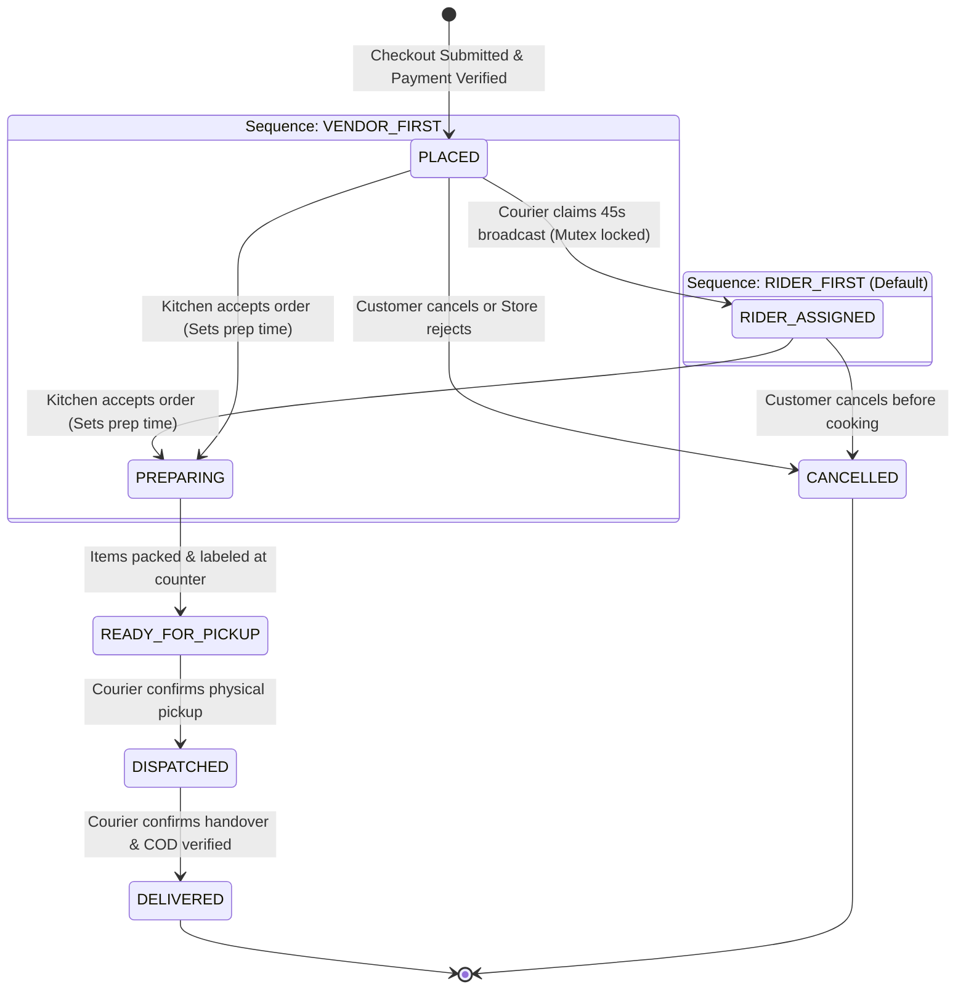

# 05 — Order State Machine & Dispatch Engine

Internal mechanics of the **Order Finite State Machine (FSM)**, Redis geospatial proximity search, distributed mutex locks, dispatch escalation, and double-entry accounting.

---

## 1. Formal Order Finite State Machine (FSM)

The system supports two sequence flows governed by the `order_flow_config` JSON in `system_settings` (`mode` + `riderSearchTimeoutSeconds`, default 90) ([ADR-002](../architecture-decision-records/ADR-002-dynamic-dual-order-flow-fsm.md)):
- **`RIDER_FIRST` (Zero Food Waste Mode — Default)**:
  `PLACED` ➔ `RIDER_ASSIGNED` ➔ `PREPARING` ➔ `READY_FOR_PICKUP` ➔ `DISPATCHED` ➔ `DELIVERED`.
- **`VENDOR_FIRST` (Traditional Retail Mode)**:
  `PLACED` ➔ `PREPARING` ➔ `READY_FOR_PICKUP` ➔ `DISPATCHED` ➔ `DELIVERED`.

### Critical Invariants:
- **Direct Preparation Transition Invariant**: When a vendor accepts an order, the runtime engine transitions the order directly to **`PREPARING`** with `accepted_at = NOW()` and `prep_time_minutes` populated (ADR-002).
- **Payment-Gated Invariant (ADR-011)**: When `paymentMethod === ONLINE_GATEWAY`, an order in `PLACED` with `paymentStatus === PENDING` will **NOT** broadcast to couriers or alert the store. Broadcast is held until cryptographic webhook verification confirms `paymentStatus === PAID`. Unpaid orders are cancelled after 15 minutes.



### Transition Validation Matrix:

| From State | Allowed Target | Permitted Roles | Invariants & Side Effects |
| :--- | :--- | :--- | :--- |
| `PLACED` | `RIDER_ASSIGNED` | `RIDER`, `SUPER_ADMIN` | In `RIDER_FIRST`: Courier claims order; triggers kitchen chime with guaranteed rider badge. |
| `PLACED` | `PREPARING` | `VENDOR_ADMIN`, `SUPER_ADMIN` | **`VENDOR_FIRST` only — enforced by the mode guard in `acceptOrder`**: vendor sets prep timer, sets `accepted_at = NOW()`, begins cooking. In `RIDER_FIRST` the accept returns `409` until a courier secures the order (accepting a riderless order would strand it in `PREPARING`, unclaimable forever). |
| `PLACED` | `CANCELLED` | `CUSTOMER`, `VENDOR_ADMIN`, `SUPER_ADMIN` | Pre-preparation cancellation. Releases payment holds or triggers refund. |
| `RIDER_ASSIGNED` | `PREPARING` | `VENDOR_ADMIN`, `SUPER_ADMIN` | Vendor reviews items, chooses prep duration, and taps Accept. |
| `RIDER_ASSIGNED` | `CANCELLED` | `CUSTOMER`, `SUPER_ADMIN` | Customer cancellation prior to kitchen prep. Releases courier lock. |
| `PREPARING` | `READY_FOR_PICKUP` | `VENDOR_ADMIN`, `SUPER_ADMIN` | Items packed at counter. In `VENDOR_FIRST`, triggers courier broadcast now. |
| `READY_FOR_PICKUP` | `DISPATCHED` | `RIDER`, `SUPER_ADMIN` | Courier confirms physical pickup at counter. Activates live GPS streaming. |
| `DISPATCHED` | `DELIVERED` | `RIDER`, `SUPER_ADMIN` | Confirms doorstep handover, validates COD cash checkbox, updates ledgers. |
| *Any Pre-Dispatched* | `CANCELLED` | `SUPER_ADMIN` | Administrative override cancellation with mandatory min-5-char audit reason. `DISPATCHED → CANCELLED` is **not** a legal edge: once the courier is on the road the trip never auto-unwinds — the rider reports a delivery issue (back to `READY_FOR_PICKUP`) or completes the delivery. Admin cancel blocks `DISPATCHED` with the same rule. |

---

## 2. Redis Geospatial Indexing & Telemetry

Rider locations are maintained in Redis spatial sets to prevent high-frequency write pressure on PostgreSQL ([ADR-003](../architecture-decision-records/ADR-003-postgis-spatial-engine-and-redis-geohash.md)):

- **Redis Key**: `riders:locations:active`
- **Location Update Command**:
  ```typescript
  await redis.geoadd('riders:locations:active', longitude, latitude, riderId);
  ```

---

## 3. Proximity Radius Broadcast Algorithm

The dispatch engine executes proximity searches according to the configured `order_flow_config.mode`:
- **`RIDER_FIRST`**: Triggered immediately at checkout (post payment verification).
- **`VENDOR_FIRST`**: Triggered after store staff marks order `READY_FOR_PICKUP`.

```typescript
async function findNearbyRiders(vendorLat: number, vendorLng: number, radiusKm: number = 5) {
  const nearbyRiderIds = await redis.geosearch(
    'riders:locations:active',
    'FROMLONLAT',
    vendorLng,
    vendorLat,
    'BYRADIUS',
    radiusKm,
    'km',
    'WITHDIST',
    'ASC'
  );

  const availableRiders: { riderId: string; distanceKm: number }[] = [];
  for (const [riderId, distance] of nearbyRiderIds) {
    const activeOrderId = await redis.get(`rider:active_order:${riderId}`);
    if (!activeOrderId) {
      availableRiders.push({ riderId, distanceKm: parseFloat(distance) });
    }
  }

  return availableRiders;
}
```

---

## 4. Concurrency Protection & Atomic Mutex Lock

To prevent duplicate order claims, the backend executes an atomic **Redis Distributed Mutex** ([ADR-004](../architecture-decision-records/ADR-004-atomic-dispatch-claim-mutex.md)):

```typescript
async function claimOrder(riderUserId: string, orderId: string): Promise<Order> {
  // 1. Verify courier online, approved, and active
  const rider = await prisma.rider.findUnique({ where: { userId: riderUserId }, include: { user: true } });
  if (!rider || !rider.isOnline) throw new BadRequestException('Rider is offline or profile not found');
  if (!rider.isApproved) throw new BadRequestException('Rider account is pending admin approval');
  if (rider.user?.status !== AccountStatus.ACTIVE) throw new BadRequestException('Rider account is suspended or inactive');

  // 2. In-flight trip busy check
  const alreadyBusy = await redis.get(`rider:active_order:${rider.id}`);
  if (alreadyBusy) throw new BadRequestException('You already have an active assigned delivery trip');

  // 3. Acquire exclusive claim mutex (10-second TTL)
  const lockKey = `lock:order_claim:${orderId}`;
  const acquired = await redis.acquireLock(lockKey, rider.id, 10);
  if (!acquired) {
    throw new ConflictException('This order is currently being claimed by another rider.');
  }

  try {
    // 4. Atomic Database Transaction
    const updatedOrder = await prisma.$transaction(async (tx) => {
      const order = await tx.order.findUnique({ where: { id: orderId }, include: { vendor: true, orderItems: true } });
      if (!order) throw new NotFoundException('Order not found');
      if (order.riderId !== null) throw new ConflictException('Order already assigned.');

      // Check COD safety limit
      if (order.paymentMethod === PaymentMethod.CASH_ON_DELIVERY) {
        if (Number(rider.cashInHand) + Number(order.totalAmount) > Number(rider.maxCashLimit)) {
          throw new BadRequestException('Order exceeds rider cash-in-hand limit. Please deposit collected cash.');
        }
      }

      assertClaimable(mode, order.status);
      const newStatus = mode === OrderFlowMode.RIDER_FIRST ? OrderStatus.RIDER_ASSIGNED : order.status;

      return await tx.order.update({
        where: { id: orderId },
        data: { riderId: rider.id, status: newStatus },
        include: { vendor: true, orderItems: true }
      });
    });

    // 5. Mark courier busy in Redis AFTER DB transaction commits successfully
    await redis.set(`rider:active_order:${rider.id}`, orderId);

    // 6. External side effects: notify vendor kitchen / customer tracking
    if (mode === OrderFlowMode.RIDER_FIRST) {
      trackingGateway.notifyOrderStatusChanged(updatedOrder.id, updatedOrder.customerId, OrderStatus.PLACED, OrderStatus.RIDER_ASSIGNED, { ... });
      trackingGateway.notifyNewOrder(updatedOrder.vendorId, { riderAssigned: true, ... });
    }

    return updatedOrder;
  } finally {
    await redis.releaseLock(lockKey, rider.id);
  }
}
```

---

## 5. Dispatch Escalation & Fallback Protocol

```
┌────────────────────────────────────────────────────────┐
│  Tier 0 (T = 0s): Broadcast within 5 km radius         │
│  - FCM Push + Socket [dispatch:broadcast] to riders    │
└───────────────────────────┬────────────────────────────┘
                            │ (Unassigned after > timeout, default 90s)
                            ▼
┌────────────────────────────────────────────────────────┐
│  Tier 1 (T > riderSearchTimeoutSeconds): radius → 6 km │
│  - Redis idempotency key: dispatch:escalated:{id}:tier1│
│  - Re-broadcasts to expanded courier radius            │
└───────────────────────────┬────────────────────────────┘
                            │ (Unassigned after > 2× timeout)
                            ▼
┌────────────────────────────────────────────────────────┐
│  Tier 2 (T > 2× timeout): radius → 10 km + Admin Radar │
│  - Emits [dispatch:escalated] to admin_hq socket room  │
│  - Dispatcher executes manual override assignment      │
└────────────────────────────────────────────────────────┘
```

### 5.1 Leader-Locked Background Sweeps (ADR-015)
To ensure background sweeps (unpaid payment expiry at 15 minutes, stale-order reaping, dispatch radius escalation) do not execute concurrently across scaled replicas, each sweep tick acquires a short-TTL Redis distributed mutex:
- **Payment Expiry Mutex**: `SET lock:sweep:expired-payments 1 NX EX 55` (60s sweep interval)
- **Stale Order Mutex**: `SET lock:sweep:stale-orders 1 NX EX 55` (60s sweep interval)
- **Dispatch Escalation Mutex**: `SET lock:sweep:dispatch-escalation 1 NX EX 25` (30s sweep interval)
Only the replica acquiring the mutex processes the tick, guaranteeing race-free escalation and cancellation side effects.

### 5.2 Geo-Targeted Push Rings & Pool-Wide Socket Broadcast
The socket `[dispatch:broadcast]` always reaches the entire `riders_pool` room (no connected courier can miss an order), while the **FCM push ring is geo-targeted** from the Redis GEO index around the pickup outlet:
- **Tier 0**: push to available riders within **5 km** of the outlet.
- **Tier 1**: push ring widens to **6 km**; admin radar alerted.
- **Tier 2**: push ring widens to **10 km**; `[dispatch:escalated]` emitted to `admin_hq`.
When the geo index has no candidates (cold start), the push falls back to a role-wide courier broadcast.

### 5.3 Stale-Order Reaper
Orders that never reached kitchen acceptance (`PLACED` / `RIDER_ASSIGNED`, COD or verified-paid online) older than `order_flow_config.stale_order_ttl_minutes` (default **60**) are auto-cancelled by `OrderService.sweepStaleOrders()` through the central cancellation engine (refund reconciliation, coupon restoration, ledger cleanup, courier release, realtime events). Unpaid online orders are excluded — the payment expiry sweep owns those. The escalation scanner caps its scan window at the same TTL, so a forgotten order can never re-broadcast or re-alert admins indefinitely.

### 5.4 Takeaway Routing
Takeaway detection reads the address snapshot's canonical `deliveryMethod` field (`TAKEAWAY` stamped at checkout). Takeaway orders notify the kitchen immediately, never enter the courier pool, and are excluded from escalation scans and the stale-order reaper is capped to unaccepted orders.

---

## 6. Financial Ledger Settlement & COD Offset Engine

Double-entry ledger records executed atomically upon order completion (`DELIVERED`) ([ADR-009](../architecture-decision-records/ADR-009-deterministic-financial-accounting-ledger.md)):

1. **Vendor Commission Entry (`CommissionLedger`)**:
   - `gross_amount`: Food subtotal minus coupon discounts.
   - `commission_amount`: `Math.round(gross_amount * (commissionRate / 100) * 100) / 100`.
   - `net_vendor_payable`: `gross_amount - commission_amount`.
2. **Rider Trip Entry (`RiderTripLedger`)**:
   - `delivery_earnings`: Configured trip remuneration credited to courier wallet.
   - `cod_collected`: Physical cash collected from customer added to courier's `cashInHand`.
3. **Cash-on-Delivery Offset**:
   - Hub cash deposits (`POST /rider/cash/deposit`) verified by admin decrement `cashInHand` and restore dispatch eligibility.
