# DeliveryOS Master Remediation & Production-Readiness Execution Plan

**Document Version**: 2.0.0  
**Date**: September 30, 2026  
**Status**: APPROVED FOR IMPLEMENTATION  
**Governing Standard**: `AGENTS.md` (3-Phase Protocol: Plan ➔ Implement ➔ Verify & Sync)  
**Primary Inputs**:
- DeliveryOS Full-Codebase Production-Readiness Audit & System Specifications
- [`system_comprehensive_audit_report.md`](file:///Users/bs0650/.gemini/antigravity/brain/0c74d6cd-e358-4ec0-8938-39ca0a4191c3/system_comprehensive_audit_report.md)


---

## 1. Executive Context & Quality Control Principles

This master execution plan synthesizes every finding from the full-codebase production-readiness audit into a **single, dependency-ordered, production-grade implementation roadmap**. Every item defines the verified bug, the exact code location, the architectural fix mechanism, the concrete code blueprint, and the automated verification suite.

### Non-Negotiable Operational Invariants (`AGENTS.md`)
1. **No Auto-Commits / No Auto-Pushes**: Git commits and pushes require separate, explicit user directives.
2. **Zero Raw `any`**: TypeScript strict typing (`"strict": true`) must be preserved without exceptions.
3. **Zero Inline Styles / Design Tokens Only**: Flutter apps use `AppColors`/`AppTypography`/`AppSpacing`; web portals use semantic Tailwind classes.
4. **ACID Financial Invariants**: Database state claims must strictly precede external gateway calls; money mutations require PostgreSQL transaction serialization.
5. **Zero Assumption / Active Clarification**: Invariants and state-machine transitions follow accepted ADRs.
### Implementation Progress Tracker
- **Phase 1: Critical Money Path & Security Hardening (P0)**: **100% COMPLETE & COMMITTED** (`5ef2a36`)
- **Phase 2: Operational Dispatch & State Integrity (P1)**: **100% COMPLETE & COMMITTED** (`5ef2a36`)
- **Phase 3: Cross-Platform Data Contracts, Deserialization & UI Alignment (P2)**: **100% COMPLETE & VERIFIED** (All 12 steps implemented and verified across backend, web, and mobile)
- **Phase 4: Living Documentation Sync, CI Gates & Release Hygiene**: **READY**

---

## 2. Master Traceability Matrix

| Step | Defect Key | Category | Severity | Primary Files | Brief Summary |
| :--- | :--- | :--- | :--- | :--- | :--- |
| **1.1** | `B1, B2` | Money / DB | **P0 (Blocker)** | `order.service.ts`, `payments.service.ts` | Double refund race & missing `REFUNDED` status persistence |
| **1.2** | `B3` | Money / Concurrency | **P0 (Blocker)** | `payments.service.ts` | Parallel payment sessions per order & non-deterministic webhook match |
| **1.3** | `SEC-01` | Security / IDOR | **P0 (Blocker)** | `order.service.ts` | Missing customer ownership check in `validateReorder` |
| **1.4** | `SEC-02` | Security / BOLA | **P0 (Blocker)** | `order.service.ts` | Unscoped courier & vendor staff access to arbitrary platform orders |
| **1.5** | `SEC-03` | Security / Scope | **P1 (High)** | `vendor-staff.service.ts` | Empty staff outlet records leak platform-wide live orders |
| **1.6** | `SEC-04` | Security / Cache | **P1 (High)** | `admin.service.ts` | Staff assignment `P2002` crash & stale Redis user session cache |
| **1.7** | `OPS-01, B7` | Mobile / Network | **P0 (Blocker)** | `payment_webview_screen.dart` | Unauthenticated `DioClient` causes infinite 401 loop on payment check |
| **1.8** | `B6` | Mobile / Cart | **P0 (Blocker)** | `cart_provider.dart`, `cart_screen.dart` | `checkout()` reads `paymentMethod` after `clearCart()`, breaking online flow |
| **1.9** | `B10-B12` | Infra / Security | **P0 (Blocker)** | `app.module.ts`, `main.ts` | Config bypass, dev secret blocklist mismatch & missing trust proxy |
| **2.1** | `OPS-02, 3A-P1`| Lifecycle / FSM | **P1 (High)** | `rider.service.ts`, `order-state.machine.ts`| Zombie orders: courier issue releases rider but leaves DB in `DISPATCHED` |
| **2.2** | `OPS-04, 3F-P1`| Mobile / Recovery | **P1 (High)** | `rider.controller.ts`, `trip_provider.dart` | No active trip rehydration on rider app launch/reboot |
| **2.3** | `B8` | Lifecycle / FSM | **P1 (High)** | `order-state.machine.ts`, `rider.service.ts`| Illegal FSM transition on pickup step in `RIDER_FIRST` mode |
| **2.4** | `B9` | Mobile / DTO | **P1 (High)** | `toggle-duty.dto.ts`, `duty_provider.dart` | 30s HTTP location sync fails with 400 due to unwhitelisted DTO fields |
| **2.5** | `OPS-03` | Sockets / Alert | **P1 (High)** | `admin.service.ts` | Admin manual force-assign fails to notify courier socket or push |
| **2.6** | `3A-P1` | Dispatch / Scope | **P1 (High)** | `order-flow.service.ts` | Takeaway orders dispatched to couriers, creating phantom broadcasts |
| **2.7** | `OPS-05` | Web / Telemetry | **P1 (High)** | `AdminDispatchPage.tsx` | Global scalar throttle drops 98% of live fleet radar telemetry |
| **2.8** | `OPS-06, 3C-P2`| Web / Search | **P1 (High)** | `admin.service.ts`, `AdminOrdersPage.tsx` | Order search & radar deep links fail beyond page 1 |
| **2.9** | `S4, 3D-P1` | Realtime / KDS | **P1 (High)** | `kdsApi.ts`, `useKDSOrders.ts` | KDS `order:new` dropped in real time due to `id` vs `orderId` mismatch |
| **2.10**| `S4, 3E-P1` | Mobile / Realtime| **P1 (High)** | `tracking_provider.dart` | Tracking provider socket handler leaks & global `.off()` stripping |
| **2.11**| `S4, 3F-P1` | Mobile / Realtime| **P1 (High)** | `socket_service.dart`, `trip_provider.dart`| Courier socket re-init loses dispatch listeners permanently |
| **3.1** | `S1, B4, B5` | Cross-Platform | **P1 (High)** | Flutter models across both apps | Prisma `Decimal` string cast TypeError kills menus, history & claim |
| **3.2** | `DAT-01, S7` | Mobile / Data | **P2 (Medium)** | `order_history_model.dart` | `productNameSnapshot`, `placedAt`, `variantSnapshot`, raw string maps |
| **3.3** | `S7` | Mobile / Data | **P2 (Medium)** | `store_catalog_model.dart` | Variant `priceModifier` mapped as `price`, causing ৳0 pricing |
| **3.4** | `S7` | Mobile / Data | **P2 (Medium)** | `store_catalog_model.dart` | Addon group `title`, `minSelection`, `maxSelection` field drift |
| **3.5** | `S7` | Mobile / Nav | **P2 (Medium)** | `banner_model.dart`, `banner_carousel.dart`| Banners link properties (`linkType`, `targetId`) unmapped |
| **3.6** | `DAT-02, S6` | Mobile / Pricing | **P2 (Medium)** | `tracking_provider.dart`, `cart_provider.dart`| `contactPhone` missing; hardcoded ৳60 fee & ৳250 coupon min spend |
| **3.7** | `DAT-03` | Mobile / Trip | **P2 (Medium)** | `trip_models.dart` | Rider trip deserializer field drift & hardcoded pickup step |
| **3.8** | `3C-P1` | Web / Admin | **P2 (Medium)** | `admin.service.ts`, `AdminVendorsPage.tsx`| Vendor radius omitted from GET, causing save to overwrite with 5 km |
| **3.9** | `3E-P1` | Mobile / GPS | **P2 (Medium)** | `address_book_screen.dart` | New address saved with device GPS coordinates instead of typed location |
| **3.10**| `3E-P2` | Mobile / Lifecycle| **P2 (Medium)** | `cart_screen.dart` | Checkout `setState` after dispose exception |
| **3.11**| `3E-P1, S7` | Mobile / UI | **P2 (Medium)** | `order_tracking_screen.dart` | Refund banner condition checks `'ONLINE'` instead of `'ONLINE_GATEWAY'` |
| **3.12**| `3D-P3` | Web / Vendor | **P3 (Low)** | `VendorOrdersPage.tsx` | Hardcoded `Platform Fee (15%)` column header |
| **4.1** | `DOC-01, 3G` | Docs / API | **P2 (Medium)** | `context_docs/TID-01..07`, `FEATURES.md` | API contracts, DTO schemas, and test script names drift |
| **4.2** | `3B-P1` | CI / Quality Gate| **P1 (High)** | `.github/workflows/ci.yml` | Non-blocking money-path integration suites (`continue-on-error: true`)|

---

## 3. Step-by-Step Master Execution Plan

```mermaid
flowchart TD
    subgraph P1["Phase 1: Critical Money Path & Security Hardening (P0)"]
        S1_1["1.1 Double Refund Fix"] --> S1_2["1.2 Payment Concurrency Mutex"]
        S1_2 --> S1_3["1.3 Reorder IDOR Fix"]
        S1_3 --> S1_4["1.4 Order BOLA Enforcement"]
        S1_4 --> S1_5["1.5 Staff Scope Leak Fix"]
        S1_5 --> S1_6["1.6 Staff Upsert & Cache Del"]
        S1_6 --> S1_7["1.7 Payment 401 Polling Fix"]
        S1_7 --> S1_8["1.8 Checkout Payment State Fix"]
        S1_8 --> S1_9["1.9 Environment & Proxy Hardening"]
    end

    subgraph P2["Phase 2: Operational Dispatch & State Integrity (P1)"]
        S2_1["2.1 Zombie Order Recovery"] --> S2_2["2.2 Active Trip Rehydration"]
        S2_2 --> S2_3["2.3 FSM RIDER_FIRST Pickup"]
        S2_3 --> S2_4["2.4 Rider Telemetry DTO"]
        S2_4 --> S2_5["2.5 Admin Force-Assign Realtime"]
        S2_5 --> S2_6["2.6 Takeaway Dispatch Filter"]
        S2_6 --> S2_7["2.7 Radar Per-Rider Throttle"]
        S2_7 --> S2_8["2.8 Admin Orders Search Query"]
        S2_8 --> S2_9["2.9 Vendor KDS Normalizer"]
        S2_9 --> S2_10["2.10 Tracking Socket Cleanup"]
        S2_10 --> S2_11["2.11 Rider Socket Re-bind"]
    end

    subgraph P3["Phase 3: Cross-Platform Data Contracts & Client UI (P2)"]
        S3_1["3.1 Tolerant Numeric Parser"] --> S3_2["3.2 Order History Fields"]
        S3_2 --> S3_3["3.3 Variant Price Modifier"]
        S3_3 --> S3_4["3.4 Addon Group Model"]
        S3_4 --> S3_5["3.5 Banner Deep Links"]
        S3_5 --> S3_6["3.6 Store Phone & Fees"]
        S3_6 --> S3_7["3.7 Rider Trip Deserializer"]
        S3_7 --> S3_8["3.8 Vendor Radius Overwrite"]
        S3_8 --> S3_9["3.9 Address Coordinates"]
        S3_9 --> S3_10["3.10 Cart Dispose Guard"]
        S3_10 --> S3_11["3.11 Refund Banner String"]
        S3_11 --> S3_12["3.12 Vendor Fee Header"]
    end

    subgraph P4["Phase 4: Living Docs Sync & CI Gates (Gate)"]
        S4_1["4.1 TID Specifications Sync"] --> S4_2["4.2 CI Blocking Integration Suites"]
        S4_2 --> S4_3["4.3 Full Quality Gate (npm run verify)"]
        S4_3 --> S4_4["4.4 Release & Changelog Sync"]
    end

    P1 --> P2
    P2 --> P3
    P3 --> P4
```



---

### Phase 1: Critical Money Path & Security Hardening (P0 Launch Blockers)

#### Step 1.1: Double Refund Prevention & Database State Synchronization
- **Bug/Issue** (`B1, B2`):
  1. `order.service.ts:842-877`: When cancelling an order, `paymentsService.refundForOrder` is called **before** the database state transition runs. If the order is concurrently marked `DELIVERED`, the DB claim rejects (`claim.count === 0`), but the external gateway refund has already executed with no rollback. Customer keeps both food and money.
  2. `payments.service.ts:484-491`: `refundForOrder` updates `refundId` and `refundedAt`, but **never sets `status: PaymentStatus.REFUNDED`**. A subsequent cancellation or duplicate call finds `status: PAID` and refunds the gateway transaction again.
- **Fix Point**:
  - `services/backend_api/src/modules/orders/order.service.ts` (`cancelCustomerOrder`, `cancelOrder`)
  - `services/backend_api/src/modules/payments/payments.service.ts` (`refundForOrder`)
- **Solution**:
  1. In `order.service.ts`: Execute the guarded state transition inside a database transaction **first**, setting order status to `CANCELLED` and payment status to `REFUND_PENDING` (or claiming the row). Only if the DB mutation succeeds do we call the gateway refund. If the gateway refund fails, log for administrative reconciliation without un-cancelling the delivered order.
  2. In `payments.service.ts`: Update `status: PaymentStatus.REFUNDED` immediately when `result.success` is true. Ensure `refundForOrder` is idempotent: if `payment.status === PaymentStatus.REFUNDED`, return existing refund details immediately without calling the gateway adapter.
- **Verification Plan**:
  - Unit test in `payments.service.spec.ts` asserting duplicate calls to `refundForOrder` execute gateway adapter exactly once and return the persisted `refundId`.
  - Concurrency test simulating an order reaching `DELIVERED` status while cancellation executes; assert that gateway refund does not fire if DB state claim fails.
- **Blast Radius / Side-Effect Guard**:
  - Affects customer order cancellation and admin cancellation flows. Does not alter normal order delivery or cash collection.

#### Step 1.2: Concurrent Payment Sessions & Deterministic Webhook Matching
- **Bug/Issue** (`B3`):
  1. `payments.service.ts:85-137`: `initiatePayment` checks `order.paymentStatus === PaymentStatus.PAID`, but does not verify whether an active `PENDING` payment session exists or lock the order. Rapid clicks create multiple parallel payment sessions with distinct `transactionId`s.
  2. `payments.service.ts:174-193`: Webhook handler finds payments via `findFirst` without `orderBy: { createdAt: 'desc' }`. If matching by `orderId`, an older abandoned session may be picked and marked `PAID`, while the actual charged transaction remains un-reconciled.
- **Fix Point**:
  - `services/backend_api/src/modules/payments/payments.service.ts` (`initiatePayment`, `handleWebhook`)
- **Solution**:
  1. In `initiatePayment`: Use Redis distributed mutex `lock:payment:order:${orderId}` (10s TTL). Check for an existing `PaymentStatus.PENDING` payment created within the last 15 minutes. If found and session is still valid, return the existing session instead of duplicating.
  2. In `handleWebhook`: Query payments matching strictly on `transactionId` first. If matching by `orderId` fallback, enforce `orderBy: { createdAt: 'desc' }` and ensure the payment status is `PENDING`.
- **Verification Plan**:
  - Parallel load test executing 5 concurrent `initiatePayment` requests for the same order; assert exactly 1 gateway session is created.
  - Webhook test asserting that incoming IPN with specific `transactionId` updates only the matching row.
- **Blast Radius / Side-Effect Guard**:
  - Confined to online payment gateway integrations (SSLCommerz and Sandbox). COD checkout is untouched.

#### Step 1.3: Reorder Validation Customer Ownership Enforcement
- **Bug/Issue** (`SEC-01`):
  - `order.service.ts:440-452`: `validateReorder(customerId, dto)` fetches `previousOrder` by ID but **never validates `previousOrder.customerId === customerId`**. Any authenticated customer can submit arbitrary UUIDs to enumerate items, prices, variants, and vendor details of other customers' past orders.
- **Fix Point**:
  - `services/backend_api/src/modules/orders/order.service.ts` (`validateReorder`)
- **Solution**:
  ```typescript
  if (previousOrder.customerId !== customerId) {
    throw new ForbiddenException('You do not have permission to reorder from this order');
  }
  ```
- **Verification Plan**:
  - Automated test in `order.service.spec.ts`: Customer A calls `validateReorder` with Customer B's order ID; assert HTTP 403 Forbidden is thrown.
- **Blast Radius / Side-Effect Guard**:
  - Valid reorder attempts by the actual owner proceed unaffected.

#### Step 1.4: Order Details & Live Tracking Multi-Role Authorization
- **Bug/Issue** (`SEC-02`):
  - `order.service.ts:525-565` & `598-618`: `getOrderById` and `getLiveTracking` only check `if (role === UserRole.CUSTOMER && order.customerId !== userId)`. Couriers (`RIDER`) and merchant staff (`VENDOR_ADMIN`) are not scoped. Any courier or merchant can view customer address, phone number, line items, and platform commission margins of any order on the entire platform.
- **Fix Point**:
  - `services/backend_api/src/modules/orders/order.service.ts` (`getOrderById`, `getLiveTracking`)
- **Solution**:
  - Enforce comprehensive RBAC scoping:
    - If `role === UserRole.CUSTOMER`: assert `order.customerId === userId`.
    - If `role === UserRole.RIDER`: assert `order.rider?.userId === userId`.
    - If `role === UserRole.VENDOR_ADMIN`: assert `order.vendorId` belongs to the outlets permitted to `userId` via `VendorStaff`.
    - If `role === UserRole.SUPER_ADMIN`: permit read.
    - Throw `ForbiddenException('You do not have permission to view this order')` on mismatch.
- **Verification Plan**:
  - Integration suite verifying Rider A cannot view Rider B's assigned order; Vendor A cannot view Vendor B's order.
- **Blast Radius / Side-Effect Guard**:
  - Prevents BOLA/IDOR data leakage across competing merchants and couriers. Legitimate tracking by order participants is fully maintained.

#### Step 1.5: Vendor Staff Live Orders Scope Leakage Guard
- **Bug/Issue** (`SEC-03`):
  - `vendor-staff.service.ts:76-125`: In `getLiveOrders(user, vendorId)`, if a `VENDOR_ADMIN` has no active outlets (`targetVendorIds` is empty), the condition `if (targetVendorIds.length > 0) whereClause.vendorId = { in: targetVendorIds }` evaluates to false. The query executes without any `vendorId` filter, returning **all live kitchen orders across all merchants platform-wide**.
- **Fix Point**:
  - `services/backend_api/src/modules/vendor-staff/vendor-staff.service.ts` (`getLiveOrders`)
- **Solution**:
  ```typescript
  if (user.role !== UserRole.SUPER_ADMIN) {
    if (targetVendorIds.length === 0) {
      return []; // Safe fail-close: unassigned staff see zero orders
    }
    whereClause.vendorId = { in: targetVendorIds };
  }
  ```
- **Verification Plan**:
  - Unit test in `vendor-staff.service.spec.ts`: Mock staff user with zero assigned outlets; assert `getLiveOrders` returns an empty array `[]`.
- **Blast Radius / Side-Effect Guard**:
  - Super admin master view remains functional (`targetVendorIds` empty permitted for super admins). Legitimate vendor staff queries continue to return only their assigned outlet orders.

#### Step 1.6: Staff Assignment Conflict Resolution & Redis Session Invalidation
- **Bug/Issue** (`SEC-04`):
  - `admin.service.ts:650-672`: `assignVendorStaff` uses `this.prisma.vendorStaff.create`. If the user was already assigned to the outlet, Prisma throws an unhandled unique constraint error (`P2002: @@unique([userId, vendorId])`). Furthermore, `auth:user:${user.id}` is cached in Redis with a 30s TTL in `JwtAuthGuard` and is not invalidated when role is updated to `VENDOR_ADMIN`.
- **Fix Point**:
  - `services/backend_api/src/modules/admin/admin.service.ts` (`assignVendorStaff`)
- **Solution**:
  - Use `prisma.vendorStaff.upsert` based on the compound key `userId_vendorId` (or check-and-update).
  - Explicitly invalidate the user session cache: `await this.redis.del(`auth:user:${user.id}`);`.
- **Verification Plan**:
  - Automated test: Assign user to Outlet 1 twice; verify second call succeeds without 500 error and updates permission scope.
- **Blast Radius / Side-Effect Guard**:
  - Admin staff management becomes idempotent and safe against race conditions.

#### Step 1.7: Customer Payment Status Polling Bearer Authentication
- **Bug/Issue** (`OPS-01, B7`):
  - `apps/customer_app/lib/features/orders/presentation/payment_webview_screen.dart:48-86`: `PaymentWebViewScreen.initState()` instantiates `_dioClient = DioClient();` without passing `storage`. As a result, requests sent to `GET /payments/status/:transactionId` lack the `Authorization: Bearer` header. Because that endpoint requires `JwtAuthGuard`, it returns 401 on every poll. The error is silently swallowed in `catch (_)`, leaving the user trapped in an infinite polling loop even after successfully paying.
- **Fix Point**:
  - `apps/customer_app/lib/features/orders/presentation/payment_webview_screen.dart`
- **Solution**:
  - Convert `PaymentWebViewScreen` from `StatefulWidget` to `ConsumerStatefulWidget`.
  - In `initState` or `_checkStatusOnce`: Obtain the authenticated HTTP client via `ref.read(dioClientProvider)`.
  - Ensure status check terminates on `PAID` or `FAILED`, properly cancelling `_pollTimer`.
- **Verification Plan**:
  - Flutter widget test verifying that `PaymentWebViewScreen` invokes `dioClientProvider` with bearer token attached, successfully parses `PaymentStatus.PAID`, and pops with success result.
- **Blast Radius / Side-Effect Guard**:
  - Unblocks the entire online payment checkout loop for mobile app users.

#### Step 1.8: Cart Checkout Payment Method Preservation Before Clear
- **Bug/Issue** (`B6`):
  - `apps/customer_app/lib/features/cart/providers/cart_provider.dart:314-321`: In `checkout()`, `clearCart()` is invoked **before** returning the result map. `clearCart()` resets `state = CartState()`, whose default `paymentMethod` is `cashOnDelivery`. The returned map evaluates `state.paymentMethod.apiKey`, which is always `'CASH_ON_DELIVERY'`. `cart_screen.dart:116` inspects `result['paymentMethod'] == 'ONLINE_GATEWAY'`, which is always false. The payment webview never opens for online orders.
- **Fix Point**:
  - `apps/customer_app/lib/features/cart/providers/cart_provider.dart` (`checkout`)
- **Solution**:
  - Capture chosen payment method and payment session prior to calling `clearCart()`:
    ```dart
    final chosenMethod = state.paymentMethod.apiKey;
    clearCart();
    return {
      'success': true,
      'orderId': orderId,
      'orderNumber': orderNumber,
      'paymentMethod': chosenMethod,
      'paymentSession': paymentSession,
    };
    ```
- **Verification Plan**:
  - Cart provider unit test asserting that checking out with `PaymentMethod.onlineGateway` returns `'ONLINE_GATEWAY'` in the result map.
- **Blast Radius / Side-Effect Guard**:
  - Restores correct navigation to `PaymentWebViewScreen` without altering COD behavior.

#### Step 1.9: Environment Boot & Reverse Proxy Trust Configuration
- **Bug/Issue** (`B10, B11, B12`):
  1. `app.module.ts:30`: Joi schema defaults `NODE_ENV` to `'development'` when unset, allowing mock OTP bypass in misconfigured production containers.
  2. `app.module.ts:37-40`: Production refresh secret blocklist checks `'deliveryos-jwt-refresh-secret-key-32chars-min'`, but `.env.example:39` ships `'deliveryos-refresh-secret-key-32chars-dev'`. A production deployment copying `.env.example` boots with a known public secret.
  3. `main.ts:29-53`: Missing `app.set('trust proxy', 1)`. Behind nginx, all clients appear as `127.0.0.1`, sharing a single global rate-limit bucket (5 OTP req/min platform-wide).
- **Fix Point**:
  - `services/backend_api/src/app.module.ts`
  - `services/backend_api/src/main.ts`
- **Solution**:
  1. In `app.module.ts`: Do not default `NODE_ENV` to development; require explicit environment declaration in production. Add `.invalid('deliveryos-refresh-secret-key-32chars-dev')` to `JWT_REFRESH_SECRET` and assert `JWT_SECRET !== JWT_REFRESH_SECRET`.
  2. In `main.ts`: Add `app.set('trust proxy', 1)` to correctly extract client IP from `X-Forwarded-For`.
- **Verification Plan**:
  - App bootstrap validation test: Attempt to start with `.env.example` refresh secret; assert boot failure.
  - Test rate limiting behind proxy header `X-Forwarded-For: 203.0.113.195` to confirm distinct throttle buckets.
- **Blast Radius / Side-Effect Guard**:
  - Prevents catastrophic auth bypass and eliminates proxy-induced platform self-DoS.

---

### Phase 2: Operational Dispatch, State Machine & Realtime Integrity (P1)

#### Step 2.1: Dead-End `DISPATCHED` Order Recovery on Delivery Issue
- **Bug/Issue** (`OPS-02, 3A-P1`):
  - `rider.service.ts:301-339`: When a courier calls `POST /rider/orders/:id/report-issue`, the method releases the rider's Redis busy lock and emits a socket event to `admin_hq`, but **writes zero updates to PostgreSQL**. The order stays in `DISPATCHED` assigned to `riderId`. The FSM only allows `DISPATCHED → DELIVERED`, and admin cancel rejects `DISPATCHED` orders. The order becomes permanently orphaned.
- **Fix Point**:
  - `services/backend_api/src/modules/riders/rider.service.ts` (`reportDeliveryIssue`)
  - `services/backend_api/src/modules/orders/order-state.machine.ts`
- **Solution**:
  - In `order-state.machine.ts`: Allow `DISPATCHED → READY_FOR_PICKUP` (for courier re-dispatch) or `DISPATCHED → CANCELLED` (with audit reason).
  - In `rider.service.ts`: Update database order record:
    ```typescript
    await this.prisma.order.update({
      where: { id: orderId },
      data: {
        riderId: null,
        status: OrderStatus.READY_FOR_PICKUP,
        rejectionReason: `Delivery issue reported by rider ${rider.user?.fullName}: ${reason}`,
      },
    });
    ```
  - Broadcast `order:status:changed` (`READY_FOR_PICKUP`) and emit `order:delivery_issue` to `admin_hq` and `riders_pool` for redispatch.
- **Verification Plan**:
  - Automated integration test: Courier reports issue; verify order status reverts to `READY_FOR_PICKUP`, `riderId` is null, and order appears in unassigned dispatch radar.
- **Blast Radius / Side-Effect Guard**:
  - Rescues stuck orders, stops customer confusion, and allows dispatchers to re-assign a new courier.

#### Step 2.2: Courier In-Flight Active Trip Rehydration
- **Bug/Issue** (`OPS-04, 3F-P1`):
  - `rider.controller.ts` lacks any `GET /rider/active-trip` endpoint. `apps/rider_app/lib/features/trips/providers/trip_provider.dart:58` initializes `activeTrip` to `null`. If a courier's phone reboots or the app process is terminated mid-trip, `activeTrip` disappears. The courier cannot complete pickup or delivery, and is permanently blocked from claiming new orders due to Redis mutex lock.
- **Fix Point**:
  - `services/backend_api/src/modules/riders/rider.controller.ts` & `rider.service.ts`
  - `apps/rider_app/lib/features/trips/providers/trip_provider.dart`
- **Solution**:
  - In `rider.controller.ts` & `rider.service.ts`: Implement `GET /api/v1/rider/active-trip`. Query orders where `riderId === currentRider.id` and `status in ['RIDER_ASSIGNED', 'ACCEPTED', 'PREPARING', 'READY_FOR_PICKUP', 'DISPATCHED']`.
  - In `trip_provider.dart`: Add `restoreActiveTrip()` to `RiderTripNotifier.build()` and application lifecycle observer. If an active trip exists, deserialize and set `state.activeTrip`.
- **Verification Plan**:
  - Unit test in `rider.service.spec.ts` returning active order for assigned courier.
  - Flutter test simulating app restart with an active order in progress; assert `activeTrip` is restored.
- **Blast Radius / Side-Effect Guard**:
  - Couriers can seamlessly recover from app crashes, battery deaths, or OS memory kills without dispatcher intervention.

#### Step 2.3: FSM Alignment for Courier Pickup in `RIDER_FIRST` Mode
- **Bug/Issue** (`B8`):
  - `order-state.machine.ts:11` & `rider.service.ts:119`: In `RIDER_FIRST` mode, the order status after claim is `RIDER_ASSIGNED`. `ORDER_TRANSITIONS['RIDER_ASSIGNED']` allows only `[OrderStatus.PREPARING, OrderStatus.CANCELLED]`. Only `READY_FOR_PICKUP` allows transition to `DISPATCHED`. In `apps/rider_app`, as soon as a courier claims an order, `currentStep` is `TripStep.pickup`. Tapping "Confirm Pickup" before the kitchen finishes preparing calls `assertTransition(RIDER_ASSIGNED, DISPATCHED)`, which throws HTTP 400.
- **Fix Point**:
  - `services/backend_api/src/modules/orders/order-state.machine.ts`
  - `services/backend_api/src/modules/riders/rider.service.ts` (`pickupOrder`)
  - `apps/rider_app/lib/features/trips/providers/trip_provider.dart`
- **Solution**:
  - In `order-state.machine.ts`: Keep strict transition `READY_FOR_PICKUP → DISPATCHED` to enforce kitchen completion, or allow `RIDER_ASSIGNED → DISPATCHED` only if direct pickup mode is enabled.
  - In `apps/rider_app`: Listen for realtime `order:status:changed`. If the order is in `RIDER_ASSIGNED` or `PREPARING`, display a clear status: "Waiting for kitchen preparation". Gate the "Confirm Pickup" button until order status reaches `READY_FOR_PICKUP`.
- **Verification Plan**:
  - Trip progression test: Verify courier cannot mark dispatched until store marks order ready; verify button activates on `order:status:changed` (`READY_FOR_PICKUP`).
- **Blast Radius / Side-Effect Guard**:
  - Prevents premature order dispatch before food is prepared.

#### Step 2.4: Courier Telemetry HTTP DTO Alignment
- **Bug/Issue** (`B9`):
  - `apps/rider_app/lib/features/dashboard/providers/duty_provider.dart:230-240`: Every 30 seconds, `duty_provider.dart` sends `{ isOnline: true, latitude: lat, longitude: lng, speed: speed }` to `PATCH /rider/duty`. `ToggleDutyDto` in `services/backend_api/src/modules/riders/dto/toggle-duty.dto.ts` only declares `isOnline`. With `forbidNonWhitelisted: true`, **every 30s telemetry sync fails with HTTP 400**.
- **Fix Point**:
  - `services/backend_api/src/modules/riders/dto/toggle-duty.dto.ts`
  - `services/backend_api/src/modules/riders/rider.service.ts` (`toggleDuty`)
- **Solution**:
  - Add optional telemetry coordinates to `ToggleDutyDto`:
    ```typescript
    @ApiPropertyOptional()
    @IsOptional()
    @IsNumber()
    latitude?: number;

    @ApiPropertyOptional()
    @IsOptional()
    @IsNumber()
    longitude?: number;

    @ApiPropertyOptional()
    @IsOptional()
    @IsNumber()
    speed?: number;
    ```
  - In `rider.service.ts`: If coordinates are supplied, update the rider's location in PostgreSQL and Redis Geo.
- **Verification Plan**:
  - Backend DTO validation test: Send `{ isOnline: true, latitude: 23.78, longitude: 90.41 }` to `PATCH /rider/duty`; assert HTTP 200 OK.
- **Blast Radius / Side-Effect Guard**:
  - Eliminates constant 400 errors in backend logs and ensures HTTP location fallback operates correctly.

#### Step 2.5: Realtime Courier Notification on Admin Force-Assign
- **Bug/Issue** (`OPS-03`):
  - `admin.service.ts:358-375`: `forceAssignRider` updates PostgreSQL and sets Redis busy key, then calls `this.trackingGateway.notifyOrderStatusChanged(order.id, order.customerId, ...)`. It never emits `order:assigned` to the courier's socket room (`rider_${riderId}` or `user_${rider.userId}`), nor does it send an FCM push notification. The courier has no idea an order has been assigned.
- **Fix Point**:
  - `services/backend_api/src/modules/admin/admin.service.ts` (`forceAssignRider`)
- **Solution**:
  - Emit realtime dispatch assignment directly to the courier:
    ```typescript
    this.trackingGateway.server.to(`rider_${rider.id}`).to(`user_${rider.userId}`).emit('order:assigned', {
      orderId: updatedOrder.id,
      orderNumber: updatedOrder.orderNumber,
      vendorName: updatedOrder.vendor.name,
      totalAmount: Number(updatedOrder.totalAmount),
    });
    ```
  - Trigger high-priority push notification via `this.notificationsService.sendToUser(rider.userId, ...)`.
- **Verification Plan**:
  - Integration test verifying socket event emission to `rider_${rider.id}` upon admin force-assignment.
- **Blast Radius / Side-Effect Guard**:
  - Couriers instantly receive assignments and open the delivery trip workflow without delay.

#### Step 2.6: Takeaway Orders Phantom Dispatch Prevention
- **Bug/Issue** (`3A-P1`):
  - `order-flow.service.ts:224-246, 310-330`: When an order is placed, `onOrderPlaced` broadcasts the order to `riders_pool` regardless of delivery method. Takeaway orders (`deliveryMethod: 'TAKEAWAY'`) do not require courier delivery, yet are broadcast to riders and picked up by escalation sweeps, producing hourly critical alerts.
- **Fix Point**:
  - `services/backend_api/src/modules/order-flow/order-flow.service.ts` (`onOrderPlaced`, `onOrderReadyForPickup`)
- **Solution**:
  - Inspect `deliveryAddressSnapshot` (or DTO):
    ```typescript
    const addressSnap = order.deliveryAddressSnapshot as Record<string, unknown> | null;
    const isTakeaway = addressSnap?.deliveryMethod === 'TAKEAWAY';
    if (isTakeaway) {
      this.logger.log(`Order ${order.orderNumber} is TAKEAWAY; skipping rider pool dispatch.`);
      return;
    }
    ```
- **Verification Plan**:
  - Test placing a takeaway order; assert no `dispatch:broadcast` event is emitted to `riders_pool`.
- **Blast Radius / Side-Effect Guard**:
  - Stops phantom alerts and prevents couriers from claiming orders meant for customer pickup.

#### Step 2.7: Admin Fleet Radar Per-Rider Telemetry Throttling
- **Bug/Issue** (`OPS-05`):
  - `apps/admin_portal/src/pages/admin/AdminDispatchPage.tsx:83-85`: `lastLocationPatchRef` uses a single scalar timestamp across the entire fleet (`if (now - lastLocationPatchRef.current < 5000) return`). When Rider 1 emits a GPS ping, updates from all other 50+ couriers for the next 5 seconds are discarded. Live radar freezes.
- **Fix Point**:
  - `apps/admin_portal/src/pages/admin/AdminDispatchPage.tsx`
- **Solution**:
  - Key the throttle timestamp per rider:
    ```typescript
    const lastLocationPatchMapRef = React.useRef<Map<string, number>>(new Map());
    // ...
    const lastTime = lastLocationPatchMapRef.current.get(fix.riderId) || 0;
    if (now - lastTime < 5000) return;
    lastLocationPatchMapRef.current.set(fix.riderId, now);
    ```
- **Verification Plan**:
  - Multi-rider telemetry simulation verifying Rider 2's marker moves on map immediately after Rider 1's ping.
- **Blast Radius / Side-Effect Guard**:
  - Ensures accurate real-time fleet visualization on dispatch consoles.

#### Step 2.8: Admin Live Orders Backend Search & Deep-Link Resolution
- **Bug/Issue** (`OPS-06, 3C-P2`):
  - `admin-governance.dto.ts:37-43` & `admin.service.ts:239-266`: `GetLiveOrdersQueryDto` lacks a `search` parameter. In `AdminOrdersPage.tsx:120-130`, search filters only the current page (20 items). When clicking a deep link from Dispatch Radar (`?orderNumber=ORD-12345`), if the order is on page 2+, 0 results are returned and auto-assignment fails.
- **Fix Point**:
  - `services/backend_api/src/modules/admin/dto/admin-governance.dto.ts`
  - `services/backend_api/src/modules/admin/admin.service.ts` (`getLiveOrders`)
  - `apps/admin_portal/src/pages/admin/AdminOrdersPage.tsx`
- **Solution**:
  - Add `@IsOptional() @IsString() search?: string;` to `GetLiveOrdersQueryDto`.
  - In `admin.service.ts`: Apply `search` across `orderNumber`, `customer.phone`, and `customer.fullName`.
  - In `AdminOrdersPage.tsx`: Pass `searchQuery` to `adminApi.getOrders`.
- **Verification Plan**:
  - Search query test verifying order on page 3 is retrieved immediately when searching by order number.
- **Blast Radius / Side-Effect Guard**:
  - Unblocks deep-linking and full catalog search across thousands of active orders.

#### Step 2.9: Vendor KDS Realtime `order:new` Event Normalization
- **Bug/Issue** (`S4, 3D-P1`):
  - `services/backend_api/src/modules/order-flow/order-flow.service.ts:266-280`: Backend emits `notifyNewOrder` with `{ orderId: order.id, ... }`. `kdsApi.ts:106` reads `id: raw.id`. Because `raw.id` is undefined, `useKDSOrders.ts:76` evaluates `if (!newOrder || !newOrder.id) return;` and drops the incoming order. Realtime order cards never appear until the next 15s poll.
- **Fix Point**:
  - `apps/vendor_portal/src/services/kdsApi.ts` (`normalizeKDSOrder`)
- **Solution**:
  - Map `id: raw.id || raw.orderId || ''`.
- **Verification Plan**:
  - Jest test for `normalizeKDSOrder` verifying input `{ orderId: 'ord-123' }` correctly produces `id: 'ord-123'`.
- **Blast Radius / Side-Effect Guard**:
  - Orders appear instantly on kitchen screens accompanied by audio chime.

#### Step 2.10: Customer Tracking Socket Leak & Clean Lifecycle
- **Bug/Issue** (`S4, 3E-P1`):
  - `apps/customer_app/lib/features/tracking/providers/tracking_provider.dart:118-125, 248-251`: Tracking provider is a non-autoDispose family. Handlers are bound globally; calling `socket.off('order:status:changed')` unbinds handlers for ALL active orders, and rooms are never left.
- **Fix Point**:
  - `apps/customer_app/lib/features/tracking/providers/tracking_provider.dart`
- **Solution**:
  - Convert provider to `autoDispose`.
  - Use scoped handler references: on dispose, leave room `socket.leaveOrder(orderId)` and unregister only the specific callback instance.
- **Verification Plan**:
  - Flutter test navigating into and out of tracking screen twice; verify zero memory leaks or duplicate socket listener triggers.
- **Blast Radius / Side-Effect Guard**:
  - Prevents memory leaks and erratic tracking updates when tracking multiple orders.

#### Step 2.11: Courier Socket Reconnect Listener Re-Binding
- **Bug/Issue** (`S4, 3F-P1`):
  - `apps/rider_app/lib/core/network/socket_service.dart:16-31` & `trip_provider.dart:58-65`: If the courier's socket connection drops and re-initializes, dispatch broadcast listeners attached to the old instance are lost. After 10 reconnect attempts, the app permanently ceases receiving trip offers.
- **Fix Point**:
  - `apps/rider_app/lib/core/network/socket_service.dart`
  - `apps/rider_app/lib/features/trips/providers/trip_provider.dart`
- **Solution**:
  - Maintain event listener registry in `SocketService` that persists across socket reconnections and auto-rebinds upon reconnect.
- **Verification Plan**:
  - Simulate network drop and reconnect in rider app; verify incoming dispatch broadcasts continue to trigger modal.
- **Blast Radius / Side-Effect Guard**:
  - Ensures couriers stay reachable during transient mobile connectivity drops.

---

### Phase 3: Cross-Platform Data Contracts, Deserialization & UI Alignment (P2)

#### Step 3.1: Universal Tolerant Numeric Parser for Flutter
- **Bug/Issue** (`S1, B4, B5`):
  - Prisma `Decimal` columns JSON-serialize as strings (e.g. `"250.00"`). Across Flutter models, fields are parsed with `as num?`, which throws a runtime `TypeError` when encountering a string. This crashes store catalogs, order history, and courier trip claims.
- **Fix Point**:
  - `apps/customer_app/lib/core/utils/numeric_parser.dart` (new shared utility)
  - `apps/rider_app/lib/core/utils/numeric_parser.dart` (new shared utility)
  - Application across all domain models in both Flutter apps.
- **Solution**:
  - Create safe numeric parsing helper:
    ```dart
    double parseDouble(dynamic value, [double defaultValue = 0.0]) {
      if (value == null) return defaultValue;
      if (value is num) return value.toDouble();
      return double.tryParse(value.toString()) ?? defaultValue;
    }
    int parseInt(dynamic value, [int defaultValue = 0]) {
      if (value == null) return defaultValue;
      if (value is num) return value.toInt();
      return int.tryParse(value.toString()) ?? defaultValue;
    }
    ```
- **Verification Plan**:
  - Comprehensive unit tests feeding `null`, `100`, `100.5`, `"100.50"`, and `""` into parsers; verify zero exceptions and exact double/int outputs.
- **Blast Radius / Side-Effect Guard**:
  - Completely immunizes mobile apps against numeric string vs number serialization discrepancies.

#### Step 3.2: Customer Order History Field Name Alignment
- **Bug/Issue** (`DAT-01, S7`):
  - `apps/customer_app/lib/features/orders/domain/order_history_model.dart:18-91`:
    1. Reads `productName` / `name` instead of `productNameSnapshot`. All items display as `"Menu Item"`.
    2. Reads `variantName` instead of `variantSnapshot: { name: "..." }`. Variants are always null.
    3. Reads `createdAt` instead of `placedAt`. `createdAt` falls back to `DateTime.now()`, making past orders display as "Just now".
    4. Maps `unavailableItems` with `.toString()`, displaying raw Dart maps (`"{productId: ...}"`) in user dialogs.
- **Fix Point**:
  - `apps/customer_app/lib/features/orders/domain/order_history_model.dart`
- **Solution**:
  - Map `name: json['productNameSnapshot'] as String? ?? json['productName'] as String? ?? json['name'] as String? ?? 'Menu Item'`.
  - Extract variant name: `final variantSnap = json['variantSnapshot'] as Map<String, dynamic>?; variantName: variantSnap?['name'] as String? ?? json['variantName'] as String?`.
  - Map `placedAt: json['placedAt'] != null ? DateTime.tryParse(json['placedAt'] as String) ?? DateTime.now() : ...`.
  - Parse `unavailableItems` extracting item `name`: `item is Map ? (item['name'] ?? item.toString()) : item.toString()`.
- **Verification Plan**:
  - Model unit test asserting authentic item names, variant labels, and placement dates are parsed from backend JSON.
- **Blast Radius / Side-Effect Guard**:
  - Past order receipts and reorder dialogs render clean, accurate text.

#### Step 3.3: Product Variant Price Modifier Alignment
- **Bug/Issue** (`S7`):
  - `store_catalog_model.dart:68`: Reads `price: (json['price'] as num?)?.toDouble()`. Prisma schema model `ProductVariant` stores `priceModifier Decimal`. `json['price']` is null, defaulting variant prices to `0.0`.
- **Fix Point**:
  - `apps/customer_app/lib/features/store/domain/store_catalog_model.dart`
- **Solution**:
  - Map `price: parseDouble(json['priceModifier'] ?? json['price'])`.
- **Verification Plan**:
  - Verify variant selection in customer menu displays correct price modifier (+৳50, +৳100).
- **Blast Radius / Side-Effect Guard**:
  - Prevents undercharging for product variants.

#### Step 3.4: Addon Group Field Alignment
- **Bug/Issue** (`S7`):
  - `store_catalog_model.dart:39-48`: Reads `name`, `minSelections`, `maxSelections`. Prisma schema `ProductAddonGroup` uses `title`, `minSelection`, `maxSelection`. Titles render empty and required addon minimums are never enforced.
- **Fix Point**:
  - `apps/customer_app/lib/features/store/domain/store_catalog_model.dart`
- **Solution**:
  - Map `name: json['title'] as String? ?? json['name'] as String? ?? ''`.
  - Map `minSelections: parseInt(json['minSelection'] ?? json['minSelections'])`.
  - Map `maxSelections: parseInt(json['maxSelection'] ?? json['maxSelections'], 5)`.
- **Verification Plan**:
  - Verify addon customizer sheet displays group title and enforces minimum selection rules.
- **Blast Radius / Side-Effect Guard**:
  - Ensures accurate menu customization and enforces kitchen order constraints.

#### Step 3.5: Promotional Banner Deep-Link Property Alignment
- **Bug/Issue** (`S7`):
  - `banner_model.dart:22-33`: Reads `actionType` and `actionValue`. Backend `Banner` model returns `linkType` and `targetId`. Tapping promotional banners does nothing.
- **Fix Point**:
  - `apps/customer_app/lib/features/banners/domain/banner_model.dart`
  - `apps/customer_app/lib/features/banners/presentation/banner_carousel.dart`
- **Solution**:
  - Map `actionType: json['linkType'] as String? ?? json['actionType'] as String?`.
  - Map `actionValue: json['targetId'] as String? ?? json['actionValue'] as String?`.
- **Verification Plan**:
  - Banner navigation test: Tapping banner with `linkType: OUTLET` navigates to target outlet catalog.
- **Blast Radius / Side-Effect Guard**:
  - Activates home screen promotional campaigns.

#### Step 3.6: Store Contact Phone & Dynamic Checkout Delivery Fee
- **Bug/Issue** (`DAT-02, S6`):
  - `tracking_provider.dart:209`: Reads `vendor['phone']`, but backend selects `vendor.contactPhone`. Store phone is always empty, disabling the "Call Store" dialer.
  - `cart_item_model.dart:124` & `cart_provider.dart:118`: Delivery fee is hardcoded to `60.0`, ignoring `estimatedDeliveryFee` returned by `POST /vendors/validate-address-coverage`. Coupon minimum spend is hardcoded to `250`.
- **Fix Point**:
  - `apps/customer_app/lib/features/tracking/providers/tracking_provider.dart`
  - `apps/customer_app/lib/features/cart/domain/cart_item_model.dart`
  - `apps/customer_app/lib/features/cart/providers/cart_provider.dart`
  - `services/backend_api/src/modules/promotions/coupons/coupon.service.ts`
- **Solution**:
  - Read `phone: vendor['contactPhone'] as String? ?? vendor['phone'] as String? ?? state.store.phone`.
  - Add `estimatedDeliveryFee` to `CartState`; populate from coverage check API.
  - Return `minOrderAmount` in `coupon.service.ts` response; check `state.grossSubtotal < state.couponMinSpend` in `cart_provider.dart`.
- **Verification Plan**:
  - Verify "Call Store" launches dialer with correct phone number; verify cart bill displays exact distance-based delivery fee.
- **Blast Radius / Side-Effect Guard**:
  - Synchronizes client checkout bill with authoritative server pricing.

#### Step 3.7: Courier Trip Model Address & Step Alignment
- **Bug/Issue** (`DAT-03`):
  - `apps/rider_app/lib/features/trips/domain/trip_models.dart:156-188`: Reads `storeRaw['address']` and `storeRaw['phone']` instead of `addressText` and `contactPhone`. Hardcodes `currentStep: TripStep.pickup` regardless of order lifecycle status.
- **Fix Point**:
  - `apps/rider_app/lib/features/trips/domain/trip_models.dart`
- **Solution**:
  - Map `address: storeRaw['addressText'] ?? storeRaw['address']`.
  - Map `phone: storeRaw['contactPhone'] ?? storeRaw['phone']`.
  - Derive `currentStep` from `json['status']`: `status === 'DISPATCHED' ? TripStep.delivery : TripStep.pickup`.
- **Verification Plan**:
  - Test deserializing trip in `DISPATCHED` status; assert `currentStep` is `TripStep.delivery` with valid contact details.
- **Blast Radius / Side-Effect Guard**:
  - Rehydrated trips open directly at the correct operational step.

#### Step 3.8: Admin Vendor Edit Delivery Radius Overwrite Prevention
- **Bug/Issue** (`3C-P1`):
  - `admin.service.ts:546-567` & `AdminVendorsPage.tsx:261`: `GET /admin/vendors` omits `deliveryRadiusKm`. The Edit Vendor modal always defaults `deliveryRadiusKm` to `5`. Saving the vendor silently overwrites custom delivery radii to 5 km.
- **Fix Point**:
  - `services/backend_api/src/modules/admin/admin.service.ts` (`getAllVendors`)
- **Solution**:
  - Include `deliveryRadiusKm: Number(v.deliveryRadiusKm)` in the mapped vendor response.
- **Verification Plan**:
  - Edit vendor with 10 km radius; verify modal displays 10 and saving preserves 10 km.
- **Blast Radius / Side-Effect Guard**:
  - Prevents inadvertent shrinking of vendor delivery coverage.

#### Step 3.9: Customer Address Coordinates vs Current Location
- **Bug/Issue** (`3E-P1`):
  - `apps/customer_app/lib/features/addresses/presentation/address_book_screen.dart:37-39`: When saving a new address, `latitude` and `longitude` are populated from the device's current location (`currentLoc.latitude`) rather than the typed address coordinates. Coverage validation evaluates against where the user is standing rather than where food should be delivered.
- **Fix Point**:
  - `apps/customer_app/lib/features/addresses/presentation/address_book_screen.dart`
- **Solution**:
  - Map Location Picker: Priority goes to explicit map pin coordinates selected in `MapLocationPickerScreen` (`customLat`/`customLng`).
  - Dynamic Forward Geocoding: For typed addresses without manual pin adjustments, query backend `GET /geo/geocode?q=...` via `LocationNotifier.forwardGeocode` (backed by OpenStreetMap and 24-hour Redis caching), replacing static coordinate dictionaries.
  - Fallback: Gracefully falls back to device GPS location if geocoding returns no match or network is unavailable.
- **Verification Plan**:
  - Save address in Mirpur while device is in Gulshan; verify saved coordinates reflect Mirpur.
- **Blast Radius / Side-Effect Guard**:
  - Ensures geofence coverage validation evaluates the genuine delivery destination.

#### Step 3.10: Checkout `setState` After Dispose Exception
- **Bug/Issue** (`3E-P2`):
  - `apps/customer_app/lib/features/cart/presentation/cart_screen.dart:104-111`: In `_handleCheckout`, `setState(() => _isSubmitting = false);` is called **before** `if (!mounted) return;`. If the user navigates away while checkout is in flight, an unhandled framework exception is thrown.
- **Fix Point**:
  - `apps/customer_app/lib/features/cart/presentation/cart_screen.dart`
- **Solution**:
  - Position the `mounted` check before updating state:
    ```dart
    final result = await ref.read(cartProvider.notifier).checkout(...);
    if (!mounted) return;
    setState(() => _isSubmitting = false);
    ```
- **Verification Plan**:
  - Automated widget test simulating unmount during checkout; assert zero exceptions thrown.
- **Blast Radius / Side-Effect Guard**:
  - Eliminates Flutter framework crash on checkout navigation.

#### Step 3.11: Tracking Screen Online Gateway Refund Banner Display
- **Bug/Issue** (`3E-P1, S7`):
  - `apps/customer_app/lib/features/tracking/presentation/order_tracking_screen.dart:115`: Checks `trackingState.paymentMethod == 'ONLINE'`. The Prisma enum value is `'ONLINE_GATEWAY'`. The condition is never satisfied and refund banners never render.
- **Fix Point**:
  - `apps/customer_app/lib/features/tracking/presentation/order_tracking_screen.dart`
- **Solution**:
  - Check `trackingState.paymentMethod == 'ONLINE_GATEWAY' || trackingState.paymentMethod == 'ONLINE'`.
- **Verification Plan**:
  - Widget test: Render cancelled online order; verify refund advisory banner is displayed.
- **Blast Radius / Side-Effect Guard**:
  - Restores clear refund communication to customers on cancelled prepaid orders.

#### Step 3.12: Vendor Portal Dynamic Platform Fee Label
- **Bug/Issue** (`3D-P3`):
  - `apps/vendor_portal/src/pages/vendor/VendorOrdersPage.tsx:116`: Column header hardcodes `Platform Fee (15%)`, whereas commission rates are variable per vendor contract in PostgreSQL (`commissionRate`).
- **Fix Point**:
  - `apps/vendor_portal/src/pages/vendor/VendorOrdersPage.tsx`
- **Solution**:
  - Change header to `Platform Fee` and render the effective commission rate per row if available.
- **Verification Plan**:
  - Verify orders table renders dynamic commission rate without misleading static 15% label.
- **Blast Radius / Side-Effect Guard**:
  - Aligns vendor financial reports with actual contract terms.

---

### Phase 4: Living Documentation Sync, CI Gates & Release Hygiene

#### Step 4.1: Technical Implementation Documents (TID-01..07) Alignment
- **Discrepancy** (`DOC-01, 3G`):
  - `TID-03`: Document actual response for `POST /auth/otp/request` (`{ retryAfterSeconds: 60 }`), `POST /orders/validate-reorder` (`{ isStoreOperational, hasStockChanges, validItems, unavailableItems }`), and `POST /vendors/validate-address-coverage` (`estimatedDeliveryFee`). Document `POST /coupons/validate` as public.
  - `FEATURES.md`: Correct HTTP methods for courier pickup (`PATCH /rider/orders/:id/pickup`) and test script names (`test:unit`, `vendor-rider:test`).
  - `ADR-011`: Note deprecation of standalone bKash adapter in favor of SSLCommerz multi-channel gateway.
- **Fix Point**:
  - `context_docs/technical-implementation-documents/03-api-specifications-and-endpoints.md`
  - `FEATURES.md`
  - `context_docs/architecture-decision-records/`
- **Verification Plan**:
  - Review documentation against running Swagger spec at `http://localhost:4000/docs`.

#### Step 4.2: CI Pipeline Unblock
- **Discrepancy** (`3B-P1`):
  - `.github/workflows/ci.yml:62`: The live-stack integration suite has `continue-on-error: true`. CI stays green even if money-path suites fail.
- **Fix Point**:
  - `.github/workflows/ci.yml`
- **Solution**:
  - Set `continue-on-error: false` once Phase 1 and Phase 2 suites pass, making integration tests a strict merge gate.
- **Verification Plan**:
  - Run GitHub Actions workflow; verify failure in any integration suite halts the pipeline.

#### Step 4.3: Full Quality Gate Execution
- **Command**:
  ```bash
  # 1. Backend Verification
  npm run verify:backend

  # 2. Web Portals Verification
  npm run verify:web

  # 3. Customer Flutter App Verification
  cd apps/customer_app && flutter analyze && flutter test

  # 4. Rider Flutter App Verification
  cd apps/rider_app && flutter analyze && flutter test

  # 5. Root Quality Gate
  npm run verify
  ```
- **Acceptance Gate**: 0 TypeScript errors, 0 ESLint errors, 0 Flutter analyzer issues, 100% passing automated tests.

#### Step 4.4: Release & Changelog Synchronization
- **Action**: Update `CHANGELOG.md` under `[Unreleased]` / version `1.1.0` detailing all security patches, money path fixes, and data contract alignments. Update `FEATURES.md` traceability status.

---

## 4. Definition of Done (DoD) & Sign-Off Checklist

Before considering this remediation complete, every assertion in this checklist must be verified:
- [x] **P0 Money Path**: No double refunds, no stranded charges, idempotent refund execution, serializable DB state mutations.
- [x] **P0 Security**: Zero IDOR in reorders, zero BOLA in order tracking, fail-close vendor staff scoping, safe staff upserts.
- [x] **Mobile Stability**: Zero unhandled 401 polling loops, checkout preserves payment method, tolerant numeric parsers eliminate `Decimal` string type errors.
- [x] **Operational Dispatch**: Zero zombie orders on courier issues, active trip rehydration functional, radar throttled per-courier, realtime KDS inserts working.
- [x] **Data Consistency**: Addon group limits enforced, variant price modifiers applied, store contact phones present, delivery fees match server estimates, dynamic geocoding replacing static dictionaries.
- [x] **Clean Code & Design Tokens**: Zero raw `any` types, zero hardcoded inline styles, strict null safety.
- [x] **Git Discipline**: Zero auto-commits, zero auto-pushes.
- [x] **Quality Gate**: `npm run verify` passes with 0 diagnostics across all packages.
